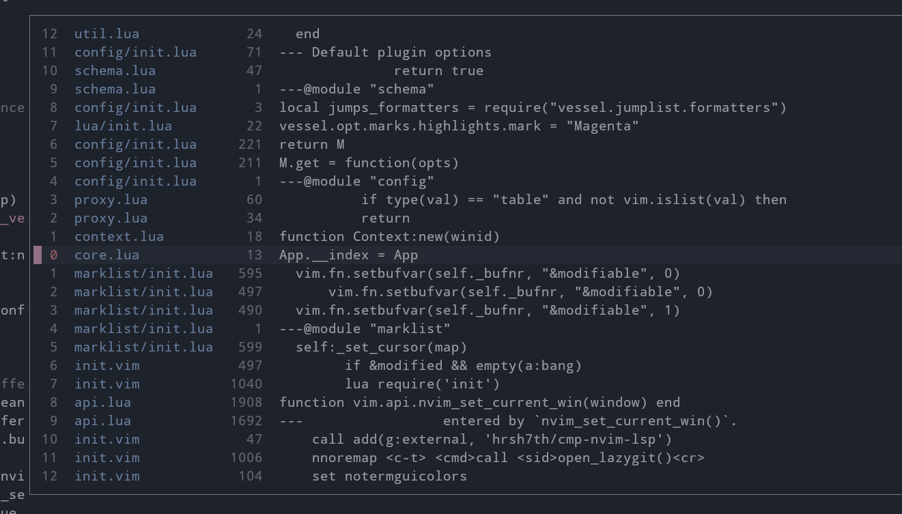

# vessel.nvim

On a quest to bring better ergonomics around *Neovim* native lists. This plugin provides nicely formatted interactive windows to better manage the **mark list**, the **buffer list** and the **jump list**.

- Highly customizable look and feel thanks to an [extensive range of options](#Configuration) and [custom formatters](#Formatters).
- Workflow still centered around native *Neovim* functionality.
- Provides useful shortcuts for **setting marks automatically** without having to pick a letter by yourself.
- Allow **changing and deleting marks** more effectively directly from the interactive mark list window.
- Allow **deleting and "resurrecting" buffers** directly from the buffer list window.




## Table of Contents

- [Setup](#setup)
- [Windows](#windows)
  - [Mark List](#mark-list-window)
  - [Jump List](#jump-list-window)
  - [Buffer List](#buffer-list-window)
- [API](#api)
  - [Mark List API](#mark-list-api)
  - [Jump List API](#jump-list-api)
  - [Buffer List API](#buffer-list-api)
  - [Mark Object](#mark-object)
  - [Jump Object](#mark-object)
  - [Buffer Object](#mark-object)
  - [Modes](#modes)
  - [Autocommand Events](#autocommand-events)
- [Configuration](#configuration)
  - [Options Validation](#options-validation)
  - [Generic Options](#generic-options)
  - [Commands Options](#commands-options)
  - [Window Options](#window-options)
  - [Jump List Options](#jump-list-options)
  - [Mark List Options](#mark-list-options)
  - [Buffer List Options](#buffer-list-options)
- [Formatters](#formatters)
  - [Example Formatters](#example-formatters)
  - [Formatter Functions Signatures](#formatter-functions-signatures)

## Setup

You can install the plugin with your favorite plugin manager.

The plugin provides a couple of basic commands to get you started:

- `:Marks` to open up a nicely formatted window with all defined `[a-z][A-Z]` marks
- `:Jumps` to open up a window with the jump list
- `:Buffers` to open up a window with the buffer list

**Commands are not automatically created**, so in order to create them you need to call the usual `setup` function and set the `create_commands` option. As you can see below, you can even change their default names if you wish to do so. If you prefer using mappings instead, skip ahead to the next section.

```lua
require("vessel").setup({
  create_commands = true,
  commands = { -- not required unless you want to customize each command name
    view_marks = "Marks",
    view_jumps = "Jumps"
    view_buffers = "Buffers"
  }
})
```

Calling the `setup` function is not required for using the plugin as internal `<plug>` mappings are automatically set up for you.

### Mark list mappings

- `<plug>(VesselViewMarks)` Show all *global* (uppercase) and local *marks* (lowercase) grouped by file.
- `<plug>(VesselViewLocalMarks)` Show only *local* (lowercase) marks.
- `<plug>(VesselViewGlobalMarks)` Show only *global* (uppercase) marks.
- `<plug>(VesselViewBufferMarks)` Show both *local* and *global* marks in the current file.
- `<plug>(VesselViewExternalMarks)` Show only *global* marks belonging to other files.
- `<plug>(VesselSetLocalMark)` Automatically set/unset a *local* mark on the current line.
- `<plug>(VesselSetGlobalMark)` Automatically set/unset a *global* mark on the current line.

### Jump list mappings

- `<plug>(VesselViewJumps)` Show the whole jump list.
- `<plug>(VesselViewLocalJumps)` Show only jumps inside the current file.
- `<plug>(VesselViewExternalJumps)` Show only jumps outside the current file.

### Buffer list mappings

- `<plug>(VesselViewBuffers)` Show the buffer list. Only normal listed buffers will be displayed. A normal buffer is a buffer with the `buftype` option empty. Unlisted buffers can be toggled later directly inside the buffer list window.

### Example mappings

Here how to use `<plug>` mappings in lua

```lua
vim.keymap.set("n", "gl", "<Plug>(VesselViewLocalJumps)")
vim.keymap.set("n", "gL", "<Plug>(VesselViewExternalJumps)")
```

and vimscript

```vim
nnoremap m. <plug>(VesselSetLocalMark)
nnoremap m, <plug>(VesselSetGlobalMark)
```

## Windows

### Mark list window

By default the mark list window shows all global and local marks grouped by the file they belong to. By default, marks are sorted by line number. To change that, head over to the [configuration section](#mark-list-options) and look for the `sort_marks` option.

Once inside the window, the following mappings are available:

- `q`, `<ESC>` Close the floating window
- `<C-J>` Move to the next mark group (path header)
- `<C-K>` Move to the previous mark group (path header)
- `d` Delete the mark under cursor
- `l`, `<CR>` Jump to the mark (or path) under cursor
- `o` Jump to the mark under cursor (does not change the jump list)
- `v` Open the mark under cursor in a vertical split
- `V` Open the mark under cursor in a vertical split with (does not change the jump list)
- `s` Open the mark under cursor in a horizontal split
- `S` Open the mark under cursor in a horizontal split (does not change the jump list)
- `t` Open the mark under cursor in a new tab
- `T` Open the mark under cursor in a new tab (does not change the jump list)
- `<SPACE>` Cycle sorting type. It will be remembered once you close and reopen the window.
- `m{a-zA-Z}` Change the mark under cursor
- `'{a-z-A-Z}` Jump directly to a mark

### Jump list window

By default the jump list window shows the entire jump list with jumps spanning multiple files. Jumps are displayed top to bottom, with the most recent jump being on top. The cursor is automatically placed on the current position in the jump list. On the left column you can see jump positions relative to the current one. You can use those relative position as a count to `<c-o>` and `<c-i>`.

Once inside the window, the following mappings are available:

- `l`, `<CR>` Jump to the line under cursor.
- `q`, `<ESC>` Close the floating window.
- `C` Clear the entire jump list.
- `<C-O>` Move backwards in the jump list (towards the bottom). As a `count`, you can use the relative number displayed on the left column.
- `<C-I>` Move forward in the jump list (towards the top). As a `count`, you can use the relative number displayed on the left column.

**NOTE**: the relative positions you see by default on the left column are not the **real relative positions** you would use as a count outside the jump list window. This is because the list can be filtered and you could potentially see big gaps between these positions otherwise.

### Buffer list window

By default the buffer list window shows all the normal buffers with the `listed` option set. Showing *unlisted* buffers can be toggled with the press of a key. By default buffers are sorted by their directory name. Head over to the [configuration section](#buffer-list-options) and look for the `sort_buffers` option to see how you can customize buffer sorting.

Once inside the window, the following mappings are available:

- `q`, `<esc>` Close the floating window,
- `l`, `<cr>` Edit the buffer under cursor.
- `t` Edit the buffer undeer cursor in a new tab.
- `s` Edit the buffer under cursor in a horizontal split.
- `v` Edit the buffer under cursor in a vertical split.
- `d` Delete the buffer under cursor. Fails if there is any unsaved change. Executes `:bdelete` on the buffer.
- `D` **Force** delete the buffer under cursor. **All unsaved changes will be lost!**. Executes `:bdelete!` on the buffer.
- `w` Wipe buffer under cursor. Fails if there is any unsaved change. Executes `:bwipeout` on the buffer.
- `W` **Force** wipe the buffer under cursor. **All unsaved changes will be lost!**. Executes `:bwipeout!` on the buffer.
- `<space>` Cycle sorting type. It will be remembered once you close and reopen the window.
- `a` Toggle showing *unlisted* buffers (`:bdelete`d buffers).

**NOTE:** Don't be afraid to delete a buffer as you can still reopen it later by simply toggling *unlisted buffers* and re-editing the buffer. This will help keeping the buffer list clean and tidy. On the other end, by wiping out the buffer you won't be able to reopen it directly from the buffer list and you'll need to use other means. See `:help :bdelete` and `:help :bwipeout` for the specific effects that each command has on buffers.

## API

All *API* functions take a single optional `opts` table argument if you want to override the default options or every option you passed to the `setup` function.

### Mark list API

- `vessel.view_marks(opts, filter_func)` Show all *global* (uppercase) and *local* marks (lowercase). With the optional `filter_func` function argument you can filter out mark entries.
- `vessel.view_local_marks(opts)` Show only *local* (lowercase) marks.
- `vessel.view_global_marks(opts)` Show only *global* (uppercase) marks.
- `vessel.view_buffer_marks(opts)` Show both *local* and *global* marks in the current file.
- `vessel.view_external_marks(opts)` Show only *global* marks belonging to different files.
- `vessel.set_local_mark(opts)` Automatically set/unset a *local* mark on the current line.
- `vessel.set_global_mark(opts)` Automatically set/unset a *global* mark on the current line.

`filter_func` is a function used to filter out entries in the mark list. If the function returns `false`, the mark won't be displayed. The function takes two arguments:

- [`mark`](#mark-object) *table* parameter representing the mark currently being filtered.
- [`context`](#context-object) *table* parameter that contains information about the current window/buffer.

```lua
-- Example usage of a filter function to show only lowercase marks
vim.keymap.set("n", "gm", function()
  require('vessel').view_marks({}, function(mark, context)
    return string.match(mark.mark, "%l")
  end)
end)
```

### Jump list API

- `vessel.view_jumps(opts, filter_func)` Show the whole jump list. With the optional `filter_func` function argument you can filter out jump entries.
- `vessel.view_local_jumps(opts)` Show only jumps inside the current file.
- `vessel.view_external_jumps(opts)` Show only jumps outside the current file.

`filter_func` is a function used to filter out entries in the jump list. If the function returns `false`, the entry won't be displayed. The function takes two arguments:

- [`jump`](#jump-object) *table* parameter representing the jump entry currently being filtered.
- [`context`](#context-object) *table* parameter that contains information about the current window/buffer.

```lua
-- Usage of a filter function to filter out jumps outside the current working directory
vim.keymap.set("n", "gL", function()
  require('vessel').view_jumps({}, function(jump, context)
    return vim.startswith(jump.bufpath, vim.fn.getcwd() .. "/")
  end)
end)
```

### Buffer list API

- `vessel.view_buffers(opts, filter_func)` Show the buffer list. Only normal listed buffers will be displayed. A normal buffer is a buffer with the `buftype` option empty. Unlisted buffers can be toggled later directly inside the buffer list window.

`filter_func` is a function used to filter out entries in the buffer list. If the function returns `false`, the buffer won't be displayed. The function takes two arguments:

- [`buffer`](#buffer-object) *table* parameter representing the buffer currently being filtered.
- [`context`](#context-object) *table* parameter that contains information about the current window/buffer.

```lua
-- Example usage of a filter function to show only init.lua files
vim.keymap.set("n", "gm", function()
  require('vessel').view_buffers({}, function(buffer, context)
    return vim.fs.basename(buffer.path) == "init.lua"
  end)
end)
```

### Context object

Throughout the *API* documentation we will refer to the `context` as something that contains information about the current window/buffer, that is the buffer currently being edited. It is a `table` object with the following keys:

- `bufnr` Current buffer number
- `bufpath` Current buffer full path
- `wininfo` Window information as returned by `vim.fn.getwininfo()`
- `curpos` Cursor position as returned by `vim.fn.getcurpos()`

### Mark object

The `Mark` object is `table` with the following keys:

- `mark` Mark letter
- `lnum` Mark line number
- `col` Mark column number
- `line` Line on which the mark is positioned
- `file` File the mark belongs to
- `loaded` Whether the file is actually loaded in memory

### Jump object

The `Jump` object is `table` with the following keys:

- `current` Whether this jump is the current position in the jump list
- `pos` Position of the jump in the jump list
- `relpos` Position of the jump relative to the current position in the jump list
- `bufnr` Buffer number
- `bufpath` Buffer full path
- `lnum` Jump line number
- `col` Jump column number
- `line` Line on which the jump is positioned

### Buffer object

The `Buffer` object is `table` with the following keys:

- `nr` Buffer number
- `path` Buffer full path
- `listed` Boolean flag indicating wheter the buffer is listed

### Modes

Modes represent how you are jumping to the targeted location. They are defined as follows:

```lua
local util = require("vessel.util")
util.modes = {
  BUFFER = 1,
  SPLIT = 2,
  VSPLIT = 3,
  TAB = 4,
}
```

### Autocommand Events

The plugin triggers `User` autocommands on certain events:

- `VesselBufferlistEnter` After the vessel buffer is created and the window opened but before any content is displayed in the buffer.
- `VesselBufferlistChanged` Each time the buffer list window content changes.
- `VesselMarklistEnter` After the vessel buffer is created and the window opened but before any content is displayed in the buffer.
- `VesselMarklistChanged` Each time the mark list window content changes
- `VesselJumplistEnter` After the vessel buffer is created and the window opened but before any content is displayed in the buffer.
- `VesselJumplistChanged` Each time the jump list window content changes.

#### How to setup custom mappings

The example below shows how you can setup your own mappings in the buffer window with the help of custom autocommand events.

Specifically, with the snippet below we try to open a file browser directly from the buffer list if we realize the buffer we're looking for is not in the list.

```lua
-- In the example below we pretend :FilExplorer is an existing command that takes a
-- path as argument and open up a file browser in that path

local vessel_aug = vim.api.nvim_create_augroup("VesselCustom", { clear = true })
-- notice the use of the "User" autocommand event
vim.api.nvim_create_autocmd("User", {
  group = vessel_aug,
  -- use the custom event name as pattern
  pattern = "VesselBufferlistEnter",
  callback = function()
    vim.keymap.set("n", ".", function()
      -- grab the selected buffer entry
      local sel = vim.b.vessel.get_selected()
        -- get_selected() can return nil on an empty list
      local path = sel and vim.fs.dirname(sel.path) or vim.fn.getcwd()
      -- close the buffer list window with the provided function
      vim.b.vessel.close_window()
      -- open up the file explorer for the given path
      vim.cmd("FileExplorer " .. vim.fn.fnameescape(path))
    end, { buffer = true })
  end,
})
```

For each list, the plugin sets a **buffer-local variable** named `vessel` that can be accessed directly with `vim.b.vessel`. This variable is a `table` that contains with the following keys:

- `map` A table mapping every line to a [mark](#mark-object), [jump](#jump-object) or [buffer](#buffer-object) on that line.
- `get_selected` Function to retrieve the *object* on the current line. Can return `nil` in case the list is empty.
- `close_window` Function to close the vessel window.

This buffer-local variable is only **available after the events** `VesselMarklistChanged`, `VesselJumplistChanged` and `VesselBufferlistChanged`.

## Configuration

You can configure the plugin in different ways. The most obvious one is by calling the classic `setup` function. Calling this function is *required* if you want to create all predefined commands.

```lua
require("vessel").setup({
  create_commands = true,
  commands = {
    view_marks = "Marks",
    view_jumps = "Jumps"
    view_buffers = "Buffers"
  },
  ...
  window = {
    relativenumber = true
  }
  ...
})
```

The plugin also offers a more succinct way of setting options by providing an `opt` interface object

```lua
local vessel = require("vessel")
vessel.opt.highlight_on_jump = true
vessel.opt.window.max_height = 50
vessel.opt.marks.mappings.close = { "Q" }
vessel.opt.buffers.name_align = "right"
```

The third way of setting options is by directly passing and option `table` argument to *API* functions. This options will override anything you passed previously to the `setup` function set via the `opt` interface object.

```lua
vim.keymap.set("n", "g", function()
  require('vessel').view_jumps({ window = { max_height = 90 } })
end)
```

### Options Validation

Whether you use the `setup` function or set options via the `opt` interface, some basic *type* validation is alsways performed before options are actually being set. Specifically, if you decide to go the `opt` interface route, you should know that each option is validated the moment it is assigned. The moment you mistakenly try to assign a wrong value type to an option, you'll get a nice error message about what you need to fix, but everything will keep working and the option will retain its original value.
### Generic Options

```lua
local vessel = require("vessel")

-- Control how much noisy the plugin is (one of :help vim.log.levels)
vessel.opt.verbosity = vim.log.levels.INFO

-- Some global marks might belong to files currently not loaded in memory.
-- In this case the plugin can't retrieve the mark line content. Set this option
-- to `false` to load in memory any such file as soon as you open the mark list window.
vessel.opt.lazy_load_buffers = true

-- Set 'cursorline' vim option for a brief period of time after a jump
-- for 'highlight_timeout' milliseconds
vessel.opt.highlight_on_jump = false
vessel.opt.highlight_timeout = 250

-- Function executed after each jump. By default it just centers the cursor vertically
-- unless vim.o.jumpotions is set to 'view'. It takes two parameters: mode and context,
-- both described in the API section of the documentation.
vessel.opt.jump_callback = <function>
```

### Commands Options

```lua
local vessel = require("vessel")

-- Whether to create commands or not
-- Note: you need to call the setup function to actually create commands
vessel.opt.create_commands = false

-- Customize each command name
vessel.opt.commands.view_marks = "Marks"
vessel.opt.commands.view_jumps = "Jumps"
```

### Window Options

```lua
local vessel = require("vessel")

-- Control the maximum height of the popup window as a percentage of the nvim UI
vessel.opt.window.max_height = 80

-- Enable/disable 'cursorline' nvim option in the popup window
vessel.opt.window.cursorline = true

-- Enable/disable 'number' nvim option in the popup window
vessel.opt.window.number = false

-- Enable/disable 'relativenumber' nvim option in the popup window
vessel.opt.window.relativenumber = false
```

```lua
local vessel = require("vessel")

--- Control how the popup looks. This options are passed directly to the
-- vim.api.nvim_open_win() function. ( See:help api-floatwin).

-- 'heigh', 'width', 'row' and 'col' may be either a number or function.
-- In the latter case the function is evaluated and its return value (must be a number)
-- used as the option value. See section below for their default implementations.

vessel.opt.window.options.relative = "editor"
vessel.opt.window.options.anchor = "NW"
vessel.opt.window.options.style = "minimal"
vessel.opt.window.options.border = "single"
vessel.opt.window.options.width = popup_width
vessel.opt.window.options.height = popup_height
vessel.opt.window.options.row = popup_row
vessel.opt.window.options.col = popup_col
```

### Default popup size and positioning functions

```lua
---@param list Marklist|Jumplist
local function popup_height(list, config)
  -- list:get_count() returns the number of entries + the number of groups
  -- (always 1 for the jump list)
  local item_count, group_count = list:get_count()
  local max_lines = item_count + group_count
  local max = math.floor(vim.o.lines * config.window.max_height / 100)
  return math.min(max_lines, max)
end

local function popup_width(config)
  local ui = vim.api.nvim_list_uis()[1]
  return math.floor(ui.width * (ui.width < 120 and 90 or 70) / 100)
end

---@param width integer The 'width' previously computed
---@param height integer The 'height' previously computed
local function popup_row(width, height)
  return math.floor((vim.o.lines / 2) - ((height + 2) / 2)) - 1
end

---@param width integer The 'width' previously computed
---@param height integer The 'height' previously computed
local function popup_col(width, height)
  local ui = vim.api.nvim_list_uis()[1]
  return math.floor((ui.width / 2) - (width / 2))
end

```

### Mark List Options

```lua
local vessel = require("vessel")

-- The pool of marks the plugin chooses from when automatically
-- picking the letter for you
vessel.opt.marks.locals = "abcdefghijklmnopqrstuvwxyz"
vessel.opt.marks.globals = "ABCDEFGHIJKLMNOPQRSTUVWXYZ"

-- Function used to sort groups. A group is a set of marks belonging to the same file.
-- Default: function(a, b) return a > b end
vessel.opt.marks.sort_groups = <function>

-- List of functions used to sort marks in the each groups.
-- First item is the function used by default.
-- Each of the fucntions in this list must return two values:
-- * A function with the signature: function(MarkA, MarkB) return boolean end
-- * A description string that will be used to give feedback to the user when
--   cycling between these function, or empty string for no feedback
-- See also 'marks.mappings.cycle_sort' option
local sorters = require("vessel.config.sorters")
vessel.opt.marks.sort_marks = { sorters.marks.by_lnum, sorters.marks.by_mark }

-- Controls the style of the file path header. Can be one of:
-- * "full": Full file path
-- * "short": Shortest unique suffix among all paths
-- * "relhome": Relative to the home directory
-- * "relcwd": Relative to the current working directory
-- Note: Has effect only when using default formatters
vessel.opt.marks.path_style = "relcwd"

-- Enable/disable unsetting a mark when trying to mark an alredy marked line
vessel.opt.marks.toggle_mark = true

-- Use backtick instead of apostrophe for jumping to marks (:help mark-motions)
vessel.opt.marks.use_backtick = false

-- Message used when the mark list is empty
vessel.opt.marks.not_found = "No marks found"

-- Position the cursor on the first line of a mark group
vessel.opt.marks.move_to_first_mark = true

-- Position the cursor on the closest mark relative to the current position in the buffer.
-- If a mark is farther from the cursor than 'proximity_threshold' lines,
-- it won't be considered
vessel.opt.marks.move_to_closest_mark = true
vessel.opt.marks.proximity_threshold = 50

-- Force displaying the group header (file path) even when there is just one group
-- Note: Has effect only when using default formatters
vessel.opt.marks.force_header = false

-- Decorations used as prefix to each formatted mark.
-- Last item is for last entries in each group.
-- Note: Has effect only when using default formatters
vessel.opt.marks.decorations = { "├ ", "└ " }

-- Show/hide mark column number
-- Note: Has effect only when using default formatters
vessel.opt.marks.show_colnr = false

-- Strip leading spaces from lines
-- Note: Has effect only when using default formatters
vessel.opt.marks.strip_lines = true

-- Functions used to format each mark / group header line
-- See "Formatters" section for more info
vessel.opt.marks.formatters.mark = <function>
vessel.opt.marks.formatters.header = <function>

-- Highlight groups used by default formatters
vessel.opt.marks.highlights.path = "Directory"
vessel.opt.marks.highlights.not_loaded = "Comment"
vessel.opt.marks.highlights.decorations = "NonText"
vessel.opt.marks.highlights.mark = "Keyword"
vessel.opt.marks.highlights.lnum = "LineNr"
vessel.opt.marks.highlights.col = "LineNr"
vessel.opt.marks.highlights.line = "Normal"

-- Close the popup window
vessel.opt.marks.mappings.close = { "q", "<esc>" }

-- Delete the mark under cursor
vessel.opt.marks.mappings.delete = { "d" }

-- Move to the next group header
vessel.opt.marks.mappings.next_group = { "<c-j>" }

-- Move to the previous group header
vessel.opt.marks.mappings.prev_group = { "<c-k>" }

-- Jump to the mark (or path) under cursor
vessel.opt.marks.mappings.jump = { "l", "<cr>" }

-- Jump to the mark under cursor (does not change the jump list)
vessel.opt.marks.mappings.keepj_jump = { "o" }

-- Open the mark under cursor in a new tab
vessel.opt.marks.mappings.tab = { "t" }

-- Open the mark under cursor in a new tab (does not change the jump list)
vessel.opt.marks.mappings.keepj_tab = { "T" }

-- Open the mark under cursor in a horizontal
vessel.opt.marks.mappings.split = { "s" }

-- Open the mark under cursor in a horizontal split
-- Does not change the jump list
vessel.opt.marks.mappings.keepj_split = { "S" }

-- Open the mark under cursor in a vertical split
vessel.opt.marks.mappings.vsplit = { "v" }

-- Open the mark under cursor in a vertical split with
-- Does not change the jump list
vessel.opt.marks.mappings.keepj_vsplit = { "V" }

-- Cycle sorting functions (See 'marks.sort_marks' option)
vessel.opt.marks.mappings.cycle_sort = { "<SPACE>" }
```

### Jump List Options

```lua
local vessel = require("vessel")

-- Display real jump entries positions.
-- There might be gaps when filters are applied to the list.
vessel.opt.jumps.real_positions = false

-- Strip leading spaces from lines
vessel.opt.jumps.strip_lines = false

-- Filter jump entries that point to empty lines
vessel.opt.jumps.filter_empty_lines = true

-- Message used when the jump list is empty
vessel.opt.jumps.not_found = "Jump list empty"

-- Prefix used for each formatted jump entry.
-- First item is the line of the current position in the jump list.
-- Note: Has effect only when using default formatters
vessel.opt.jumps.indicator = { " ", " " }

-- Show/hide jump entries column numbers
-- Note: Has effect only when using default formatters
vessel.opt.jumps.show_colnr = false

-- Functions used to format each jump entry line
-- See "Formatters" section for more info
vessel.opt.jumps.formatters.jump = <function>

-- Mapping used to move backwards in the jump list (to the bottom of the window).
-- Takes a count.
vessel.opt.jumps.mappings.ctrl_o = "<c-o>"

-- Mapping used to move forwards in the jump list (to the top of the window).
-- Takes a count.
vessel.opt.jumps.mappings.ctrl_i = "<c-i>"

-- Jump to the entry under cursor
vessel.opt.jumps.mappings.jump = { "l", "<cr>" }

-- Close the popup window
vessel.opt.jumps.mappings.close = { "q", "<esc>" }

-- Clear the jump list (executes :clearjumps)
vessel.opt.jumps.mappings.clear = { "C" }

-- Highlight groups used by default formatters
vessel.opt.jumps.highlights.indicator = "Comment"
vessel.opt.jumps.highlights.pos = "LineNr"
vessel.opt.jumps.highlights.current_pos = "CursorLineNr"
vessel.opt.jumps.highlights.path = "Directory"
vessel.opt.jumps.highlights.lnum = "LineNr"
vessel.opt.jumps.highlights.col = "LineNr"
vessel.opt.jumps.highlights.line = "Normal"
```

### Buffer List Options

```lua
local vessel = require("vessel")

-- Message used when the jump list is empty
vessel.opt.buffers.not_found = "Buffer list empty"

-- label used for unnamed buffers
vessel.opt.buffers.unnamed_label = "[no name]"

-- Function called for buffers that are directories (after splits)
-- By default assumes Netrw is enabled (g:loaded_netrwPlugin == 1) and simply
-- executes :edit command on the buffer
vessel.opt.buffers.directory_handler = <function>

-- List of functions used to sort buffers.
-- First item is the function used by default.
-- Each of the fucntions in this list must return two values:
-- * A function with the signature: function(BufferA, BufferB) return boolean end
-- * A description string that will be used to give feedback to the user when
--   cycling between these function, or empty string for no feedback
-- See also 'buffers.mappings.cycle_sort' option
vessel.opt.buffers.sort_buffers = { sorters.buffers.by_path, sorters.buffers.by_basename }

-- How to align the buffer name. Can be one of:
-- * "left": Left alignment
-- * "right": Right alignment
-- * "none": No alignment
-- Note: Has effect only when using the default formatter.
vessel.opt.buffers.bufname_align = "left"

-- Buffer name style. Can be one of:
-- * "basename": Buffer base name
-- * "unique": Shortest unique suffix among all paths
-- * "hide": Hide bufname completely
-- Note: Has effect only when using the default formatter.
vessel.opt.buffers.bufname_style = "unique"

-- Buffer path style. Can be one of:
-- * "full": Full file path
-- * "short": Shortest unique suffix among all paths
-- * "relhome": Relative to the home directory
-- * "relcwd": Relative to the current working directory
-- * "hide": Hide buffer path completely
-- Note: Has effect only when using the default formatter
vessel.opt.buffers.bufpath_style = "relcwd"

-- Cycle sorting functions (See 'buffers.sort_buffers' option)
vessel.opt.buffers.mappings.cycle_sort = { "<space>" }

-- Toggle unlisted buffers
vessel.opt.buffers.mappings.toggle_unlisted = { "a" }

-- Edit buffer under cursor
vessel.opt.buffers.mappings.edit = { "l", "<cr>" }

-- Edit buffer under cursor in a new tab
vessel.opt.buffers.mappings.tab = { "t" }

-- Edit buffer under cursor in a horizontal split
vessel.opt.buffers.mappings.split = { "s" }

-- Edit buffer under cursor in a vertical split
vessel.opt.buffers.mappings.vsplit = { "v" }

-- :bdelete buffer under cursor (fails with unsaved changes)
vessel.opt.buffers.mappings.delete = { "d" }

-- :bdelete! buffer under cursor (all unsaved changes will be lost!)
vessel.opt.buffers.mappings.force_delete = { "D" }

-- :bwipeout buffer under cursor (fails with unsaved changes)
vessel.opt.buffers.mappings.wipe = { "w" }

-- :bwipeout! buffer under cursor (all unsaved changes will be lost!)
vessel.opt.buffers.mappings.force_wipe = { "W" }

-- Close the buffer list window
vessel.opt.buffers.mappings.close = { "q", "<esc>" }

-- Functions used to format each buffer entry line
-- See "Formatters" section for more info
vessel.opt.buffers.formatters.buffer = buf_formatters.buffer_formatter,

-- Highlight groups used by the default formatter
vessel.opt.buffers.highlights.bufname = "Normal"
vessel.opt.buffers.highlights.bufpath = "Comment"
vessel.opt.buffers.highlights.unlisted = "Comment"
vessel.opt.buffers.highlights.directory = "Directory"
vessel.opt.buffers.highlights.modified = "Keyword"
```

## Formatters

Formatters are functions that let you customize how each line of the floating window is going to look.

All formatter functions take four arguments: the object being formatted, the [context object](#context-object), a `meta` table object, and a `config` table object. They all should return a `string` and an optional special `table` used by the plugin for setting up highlighting.

Most of the time you'll want to highlight specific parts of the formatted line. To make things easier the plugin provides a special `format` function you can call in order to automatically generate the correct return values. This utility function is very similar to the lua native `string.format()`, but the unlike it, our format function only accepts `%s` placeholders.

```lua
> format = require("vessel.util").format
> line, hl = format("%s : %s %s", {"foo", "Normal"}, "bar", {"baz", "LineNr"})
> print(line)
foo : bar baz
> vim.inspect(hl)
{ {
    startpos = 1
    endpos = 3,
    hlgroup = "Normal",
}, {
    startpos = 11
    endpos = 13,
    hlgroup = "LineNr",
} }
```

### Example Formatters

```lua
local util = require("vessel.util")

-- Note: You can return nil from a header formatter to prevent
-- the line from being displayed in the list
local function header_formatter(path, meta, context, config)
    local path = meta.suffixes[path]
    return util.format("# %s", {path, "Directory"})
end

local function mark_formatter(mark, meta, context, config)
    -- different colors for uppercase and lowercase marks
    local hl = string.match(mark.mark, "%u") and "Blue" or "Red"
    return util.format(" [%s] %s:%s %s",
        {mark.mark, hl},
        {mark.lnum, "LineNr"},
        {mark.col, "LineNr"},
        {mark.line, "Normal"}
    )
end
```

In this more complex example we'll remove the header and display the file name on each line instead:

```lua
local util = require("vessel.util")
local vessel = require("vessel")

vessel.opt.marks.formatters.header = function(path, meta, context, config)
  return
end

vessel.opt.marks.formatters.mark = function(mark, meta, context, config)
    -- Makes sure each line number is vertically aligned
  local lnum_fmt = "%" .. #tostring(meta.max_lnum) .. "s"
  local lnum = string.format(lnum_fmt, mark.lnum)

  local line, line_hl
  if mark.loaded then
    -- strips leading white spaces from each line
    line = string.gsub(mark.line, "^%s+", "")
    line_hl = "Normal"
  else
    -- If the file the mark belongs to is not loaded in memory,
    -- display its path instead
    line = util.prettify_path(mark.file)
    line_hl = "Comment"
  end

  -- Display a vertically aligned file name
  local path_fmt = "%-" .. meta.max_suffix .. "s" -- align file names
  local path = string.format(path_fmt, meta.suffixes[mark.file])

  return util.format(
    " [%s]  %s %s %s",
    { mark.mark, "Keyword" },
    { path, "Directory" },
    { lnum, "LineNr" },
    { line, line_hl }
  )
end
```

### Formatter Functions Signatures

#### marks.formatters.header

```lua
vessel.opt.marks.formatters.header = <function>
```

Controls how each group header (file path) in the mark list is formatted. Takes the following four arguments:

- `path` The full path being formatted.
- `context` Table containing information about the current window/buffer. See the [context object](#context-object) section.
- `config` Table containing the complete configuration.
- `meta` Table containing additional contextual information. It has the following keys:
  - `groups_count` Total number of groups.
  - `suffixes` Table mapping each full path to its shortest unique suffix among all paths.
  - `max_suffix` Maximum length among all suffixes above.

#### marks.formatters.mark

```lua
vessel.opt.marks.formatters.mark = <function>
```

Controls how each mark in the mark list is formatted. Takes the following four arguments:

- `mark` The mark being formatted. See the [mark object](#mark-object) section.
- `context` Table containing information about the current window/buffer. See the [context object](#context-object) section.
- `config` Table containing the complete configuration
- `meta` Table containing additional contextual information. It has the following keys:
  - `pos` Position of the mark being formatted in the group.
  - `is_last` Whether the mark being formatted is last in the group.
  - `groups_count` Total number of mark groups.
  - `max_lnum` Highest line number among all mark groups.
  - `max_col` Highest column number among all mark groups.
  - `max_group_lnum` Highest line number in the current group.
  - `max_group_col` Highest column number in the group.
  - `suffixes` Table mapping each full path to its shortest unique suffix among all paths.
  - `max_suffix` Max string length among all suffixes above.

#### jumps.formatters.jump

```lua
vessel.opt.jumps.formatters.jump = <function>
```

Controls how each line of the jump list is formatted. Takes the following four arguments:

- `jump` The jump being formatted. See the [jump object](#jump-object) section.
- `context` Table containing information about the current window/buffer. See the [context object](#context-object) section.
- `config` Table containing the complete configuration.
- `meta` Table containing additional contextual information. It has the following keys:
  - `jumps_count` Total number of jumps.
  - `current_line` Line number of the jump being formatted.
  - `current_jump_line` Line number of the current jump position.
  - `max_lnum` Max line number among all jumps.
  - `max_col` Max column number among all jumps.
  - `max_relpos` Max relative number among all jumps.
  - `max_basename` Max basename length among all jumps paths.
  - `suffixes` Table mapping each full path to its shortest unique suffix among all paths.
  - `max_suffix` Max string length among all suffixes above.

#### buffers.formatters.buffer

```lua
vessel.opt.buffers.formatters.buffer = <function>
```

Controls how each line of the buffer list is formatted. Takes the following four arguments:

- `buffer` The buffer being formatted. See the [buffer object](#buffer-object) section.
- `context` Table containing information about the current window/buffer. See the [context object](#context-object) section.
- `config` Table containing the complete configuration.
- `meta` Table containing additional contextual information. It has the following keys:
  - `current_line` Line number of the buffer being formatted.
  - `max_basename` Max basename length among all buffer paths.
  - `suffixes` Table mapping each full path to its shortest unique suffix among all paths.
  - `max_suffix` Max string length among all suffixes above.
