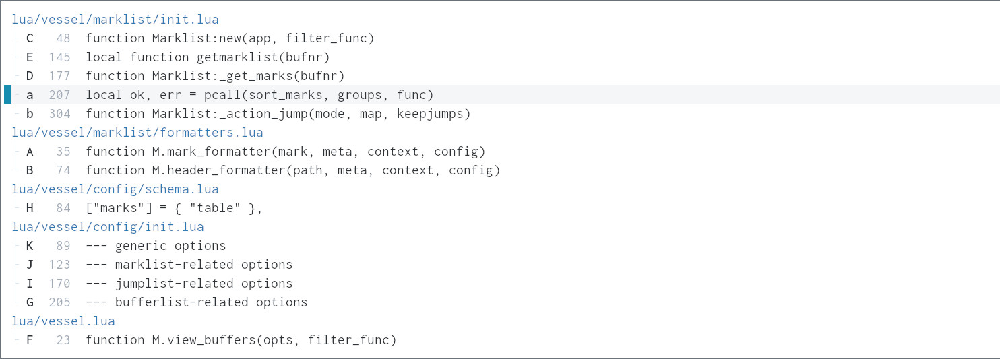
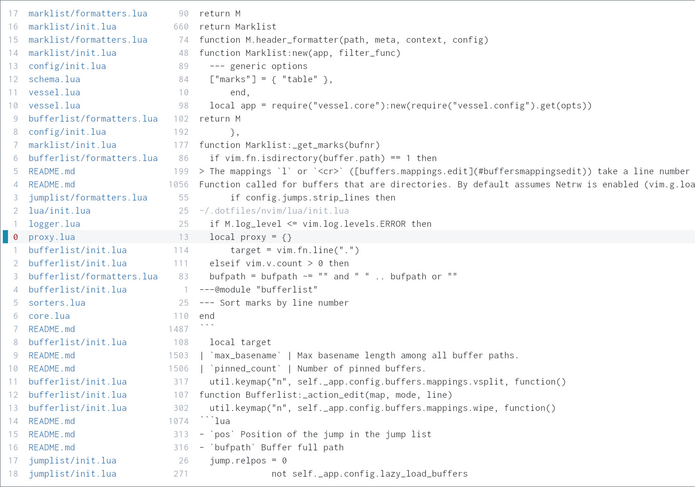
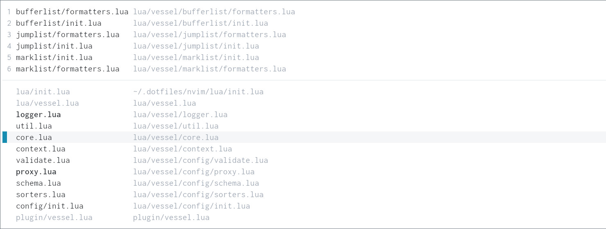

# vessel.nvim

On a quest to bring better ergonomics around *Neovim* native lists. This plugin provides nicely formatted interactive windows to better manage the **mark list**, the **buffer list** and the **jump list**.

- Highly customizable look and feel thanks to an [extensive range of options](#Configuration) and [custom formatters](#Formatters).
- Workflow still centered around native *Neovim* functionality.
- Provides useful shortcuts for **setting marks automatically** without having to pick a letter by yourself.
- Allow **changing and deleting marks** more effectively directly from the interactive mark list window.
- Allow **deleting and "resurrecting" buffers** directly from the buffer list window.

## Table of Contents

- [Setup](#setup)
- [Windows](#windows)
  - [Mark List Window](#mark-list-window)
  - [Jump List Window](#jump-list-window)
  - [Buffer List Window](#buffer-list-window)
  - [Pinned Buffers](#pinned-buffers)
- [API](#api)
  - [Mark List API](#mark-list-api)
  - [Jump List API](#jump-list-api)
  - [Buffer List API](#buffer-list-api)
  - [Mark Object](#mark-object)
  - [Jump Object](#jump-object)
  - [Buffer Object](#mark-object)
  - [Modes](#modes)
  - [Autocommand Events](#autocommand-events)
- [Configuration](#configuration)
  - [Options Validation](#options-validation)
  - [Generic Options](#generic-options)
  - [Commands Options](#commands-options)
  - [Window Options](#window-options)
  - [Jump List Options](#jump-list-options)
  - [Mark List Options](#mark-list-options)
  - [Buffer List Options](#buffer-list-options)
- [Formatters](#formatters)
  - [Example Formatters](#example-formatters)
  - [Formatter Functions Signatures](#formatter-functions-signatures)

## Setup

You can install the plugin with your favorite plugin manager.

The plugin provides a couple of basic commands to get you started:

- `:Marks` to open up a nicely formatted window with all defined `[a-z][A-Z]` marks
- `:Jumps` to open up a window with the jump list
- `:Buffers` to open up a window with the buffer list

**Commands are not automatically created**, so in order to create them you need to call the usual `setup` function and set the `create_commands` option. As you can see below, you can even change their default names if you wish to do so. If you prefer using mappings instead, skip ahead to the next section.

```lua
require("vessel").setup({
  create_commands = true,
  commands = { -- not required unless you want to customize each command name
    view_marks = "Marks",
    view_jumps = "Jumps"
    view_buffers = "Buffers"
  }
})
```

Calling the `setup` function is not required for using the plugin as internal `<plug>` mappings are automatically set up for you.

### Mark List Mappings

| Plug Mapping                      | Action                                                                      |
|-----------------------------------|-----------------------------------------------------------------------------|
| `<plug>(VesselViewMarks)`         | Show all *global* (uppercase) and local *marks* (lowercase) grouped by file.|
| `<plug>(VesselViewLocalMarks)`    | Show only *local* (lowercase) marks.                                        |
| `<plug>(VesselViewGlobalMarks)`   | Show only *global* (uppercase) marks.                                       |
| `<plug>(VesselViewBufferMarks)`   | Show both *local* and *global* marks in the current file.                   |
| `<plug>(VesselViewExternalMarks)` | Show only *global* marks belonging to other files.                          |
| `<plug>(VesselSetLocalMark)`      | Automatically set/unset a *local* mark on the current line.                 |
| `<plug>(VesselSetGlobalMark)`     | Automatically set/unset a *global* mark on the current line.                |

### Jump List mappings

| Plug Mapping                      | Action                                                                      |
|-----------------------------------|-----------------------------------------------------------------------------|
| `<plug>(VesselViewJumps)`         | Show the whole jump list.                                                   |
| `<plug>(VesselViewLocalJumps)`    | Show only jumps inside the current file.                                    |
| `<plug>(VesselViewExternalJumps)` | Show only jumps outside the current file.                                   |

### Buffer List Mappings

| Plug Mapping                | Action                                                                |
|-----------------------------|-----------------------------------------------------------------------|
| `<plug>(VesselViewBuffers)` | Show the buffer list. Only *normal listed buffers* will be displayed. |

> [!NOTE]
> - A *normal buffer* is a buffer with the `buftype` option empty.
> - Unlisted buffers can be toggled later directly inside the buffer list window.

### Example Mappings

Here how to use `<plug>` mappings in lua

```lua
vim.keymap.set("n", "gl", "<Plug>(VesselViewLocalJumps)")
vim.keymap.set("n", "gL", "<Plug>(VesselViewExternalJumps)")
```

and vimscript

```vim
nnoremap m. <plug>(VesselSetLocalMark)
nnoremap m, <plug>(VesselSetGlobalMark)
```

## Windows



### Mark List Window

By default the mark list window shows all global and local marks grouped by the file they belong to. By default, marks are sorted by line number. To change that, head over to the [configuration section](#mark-list-options) and look for the `sort_marks` option.

Once inside the window, the following mappings are available:

| Mapping      | Action                                                                               |
|--------------|--------------------------------------------------------------------------------------|
| `q`, `<ESC>` | Close the floating window.                                                           |
| `<C-J>`      | Move to the next mark group (path header).                                           |
| `<C-K>`      | Move to the previous mark group (path header).                                       |
| `d`          | Delete the mark under cursor.                                                        |
| `l`, `<CR>`  | Jump to the mark (or path) under cursor.                                             |
| `o`          | Jump to the mark under cursor (does not change the jump list).                       |
| `v`          | Open the mark under cursor in a vertical split.                                      |
| `V`          | Open the mark under cursor in a vertical split with (does not change the jump list). |
| `s`          | Open the mark under cursor in a horizontal split.                                    |
| `S`          | Open the mark under cursor in a horizontal split (does not change the jump list).    |
| `t`          | Open the mark under cursor in a new tab.                                             |
| `T`          | Open the mark under cursor in a new tab (does not change the jump list).             |
| `<SPACE>`    | Cycle sorting type. It will be remembered once you close and reopen the window.      |
| `m{a-zA-Z}`  | Change the mark under cursor.                                                        |
| `'{a-z-A-Z}` | Jump directly to a mark.

> [!NOTE]
> By default, lines cannot be displayed for files that are not loaded in memory. You'll see instead the mark file path greyed out. To automatically load in memory all files for which marks exist, you can set the [lazy_load_buffers](#lazy_load_buffers) option to `false`.

### Jump List Window



By default the jump list window shows the entire jump list with jumps spanning multiple files. Jumps are displayed top to bottom, with the most recent jump being on top. The cursor is automatically placed on the current position in the jump list. On the left column you can see jump positions relative to the current one. You can use those relative position as a count to `<c-o>` and `<c-i>`.

Once inside the window, the following mappings are available:

| Mapping      | Action                                                         |
|--------------|----------------------------------------------------------------|
| `l`, `<CR>`  | Jump to the line under cursor.                                 |
| `q`, `<ESC>` | Close the floating window.                                     |
| `C`          | Clear the entire jump list.                                    |
| `<C-O>`      | Move backwards in the jump list (towards the bottom).          |
| `<C-I>`      | Move forward in the jump list (towards the top).               |
| `r`          | Load the file under cursor in memory.                          |
| `R`          | Load all files in memory.                                      |
| `W`          | Load in memory all files inside the current working directory. |

> [!TIP]
>  As a count to `<C-O>` and `<C-I>`, you can use the relative number displayed on the left column.

> [!NOTE]
> The relative positions you see by default on the left column are not the **real relative positions** you would use as a count outside the jump list window. This is because the list can be filtered and you could potentially see big gaps between these positions otherwise.

#### Autoloading buffers

By default, lines cannot be displayed for files that are not loaded in memory. You'll see instead the jump file path greyed out. To automatically load in memory all files for which jumps exist, you can set the [lazy_load_buffers](#lazy_load_buffers) option to `false`, or use the provided mappings `r`, `R` and `W` to load the files as necessary. If you decide to disable lazy loading, have also a look at the [jumps.autoload_filter](#jumpsautoload_filter) option as it might help limiting the files that get automatically loaded in memory.

### Buffer List Window



By default the buffer list window shows all the normal buffers with the `listed` option set. Showing *unlisted* buffers can be toggled with the press of a key. By default buffers are sorted by their directory name. Head over to the [configuration section](#buffer-list-options) and look for the `sort_buffers` option to see how you can customize buffer sorting.

Once inside the window, the following mappings are available:

| Mapping      | Action                                                                                                          |
|--------------|-----------------------------------------------------------------------------------------------------------------|
| `q`, `<ESC>` | Close the floating window,                                                                                      |
| `l`, `<CR>`  | Edit the buffer under cursor. Takes a count.                                                                    |
| `t`          | Edit the buffer undeer cursor in a new tab.                                                                     |
| `s`          | Edit the buffer under cursor in a horizontal split.                                                             |
| `v`          | Edit the buffer under cursor in a vertical split.                                                               |
| `d`          | Delete the buffer under cursor. Fails if there is any unsaved change. Executes `:bdelete` on the buffer.        |
| `D`          | Force delete the buffer under cursor. **All unsaved changes will be lost!** Executes `:bdelete!` on the buffer. |
| `w`          | Wipe buffer under cursor. Fails if there is any unsaved change. Executes `:bwipeout` on the buffer.             |
| `W`          | Force wipe the buffer under cursor. **All unsaved changes will be lost!** Executes `:bwipeout!` on the buffer.  |
| `<SPACE>`    | Cycle sorting type. It will be remembered once you close and reopen the window.                                 |
| `a`          | Toggle showing *unlisted* buffers (Buffers on which you executed `:bdelete`).                                   |
| `p`          | Pin/unpin the buffer under cursor.                                                                              |
| `<c-k>`      | Decrease the buffer position in the *pinned list* (moves the buffer up).                                        |
| `<c-j>`      | Increase the buffer position in the *pinned list* (moves the buffer down).                                      |


> [!NOTE]
> Don't be afraid to delete buffers. You can still re-open them later by simply toggling *unlisted buffers* and re-editing them. This can help keeping the buffer list clean and tidy. On the other end, by wiping out the buffer you won't be able to reopen it directly from the buffer list and you'll need to use other means. See `:help :bdelete` and `:help :bwipeout` for the specific effects that each command has on buffers.

> [!TIP]
> The mappings `l` or `<cr>` ([buffers.mappings.edit](#buffersmappingsedit)) take a line number as a count. When the [buffers.quickjump](#buffersquickjump) option is off and [line numbers are shown](#windownumber), you can simply type the line number and then press `l` or `<cr>` to instantly edit the buffer on that line.

### Pinned Buffers

Pinned buffers are buffers that always stay at the top of the window and and are not influenced by the current sort type. Together they form the *pinned list* and are separated from other buffers by a [separator](#bufferspin_separator).

This list is particularly useful when combined with the [buffers.quickjump](#buffersquickjump) option. With this option enabled, you can quickly jump to the top `[1-9]` buffers just by pressing a number. Buffers positions follow the natural order of line numbers so, in order to select the right buffer, you need to either enable line numbers for the whole window with the option [window.number](#windownumber) or, if you only want to display numbers for the *pinned list*, the option [buffers.show_pin_positions](#buffersshow_pin_positions).

The order of buffers in the *pinned list* can be manually adjusted. See mappings [buffers.pin_increase](#bufferspin_increase) and [buffers.pin_decrease](#bufferspin_decrease).

> [!NOTE]
> When enabled, the `buffers.quickjump` also works for unpinned buffers, but it's going to be less effective since you can't control the buffers positions unless they are in the *pinned list*.

## API

All *API* functions take a single optional `opts` table argument if you want to override the default options or every option you passed to the `setup` function.

### Mark List API

| Function                               | Action                                                       |
|----------------------------------------|--------------------------------------------------------------|
| `vessel.view_marks(opts, filter_func)` | Show all *global* (uppercase) and *local* marks (lowercase). |
| `vessel.view_local_marks(opts)`        | Show only *local* (lowercase) marks.                         |
| `vessel.view_global_marks(opts)`       | Show only *global* (uppercase) marks.                        |
| `vessel.view_buffer_marks(opts)`       | Show both *local* and *global* marks in the current file.    |
| `vessel.view_external_marks(opts)`     | Show only *global* marks belonging to different files.       |
| `vessel.set_local_mark(opts)`          | Automatically set/unset a *local* mark on the current line.  |
| `vessel.set_global_mark(opts)`         | Automatically set/unset a *global* mark on the current line. |

`filter_func` is a function used to filter out entries in the mark list. If the function returns `false`, the mark won't be displayed. The function takes two arguments:

- [`mark`](#mark-object) *table* parameter representing the mark currently being filtered.
- [`context`](#context-object) *table* parameter that contains information about the current window/buffer.

```lua
-- Example usage of a filter function to show only lowercase marks
vim.keymap.set("n", "gm", function()
  require('vessel').view_marks({}, function(mark, context)
    return string.match(mark.mark, "%l")
  end)
end)
```

### Jump List API

| Function                               | Action                                    |
|----------------------------------------|------------------------------------------ |
| `vessel.view_jumps(opts, filter_func)` | Show the whole jump list.                 |
| `vessel.view_local_jumps(opts)`        | Show only jumps inside the current file.  |
| `vessel.view_external_jumps(opts)`     | Show only jumps outside the current file. |

`filter_func` is a function used to filter out entries in the jump list. If the function returns `false`, the entry won't be displayed. The function takes two arguments:

- [`jump`](#jump-object) *table* parameter representing the jump entry currently being filtered.
- [`context`](#context-object) *table* parameter that contains information about the current window/buffer.

```lua
-- Usage of a filter function to filter out jumps outside the current working directory
vim.keymap.set("n", "gL", function()
  require('vessel').view_jumps({}, function(jump, context)
    return vim.startswith(jump.bufpath, vim.fn.getcwd() .. "/")
  end)
end)
```

### Buffer List API

| Function                                 | Action                                                                |
|------------------------------------------|-----------------------------------------------------------------------|
| `vessel.view_buffers(opts, filter_func)` | Show the buffer list. Only *normal listed* buffers will be displayed. |

> [!NOTE]
> - A *normal buffer* is a buffer with the `buftype` option empty.
> - Unlisted buffers can be toggled later directly inside the buffer list window.

`filter_func` is a function used to filter out entries in the buffer list. If the function returns `false`, the buffer won't be displayed. The function takes two arguments:

- [`buffer`](#buffer-object) *table* parameter representing the buffer currently being filtered.
- [`context`](#context-object) *table* parameter that contains information about the current window/buffer.

```lua
-- Example usage of a filter function to show only init.lua files
vim.keymap.set("n", "gm", function()
  require('vessel').view_buffers({}, function(buffer, context)
    return vim.fs.basename(buffer.path) == "init.lua"
  end)
end)
```

### Context Object

Throughout the *API* documentation we will refer to the `context` as something that contains information about the current window/buffer, that is the buffer currently being edited. It is a `table` object with the following keys:

- `bufnr` Current buffer number
- `bufpath` Current buffer full path
- `wininfo` Window information as returned by `vim.fn.getwininfo()`
- `curpos` Cursor position as returned by `vim.fn.getcurpos()`

### Mark Object

The `Mark` object is `table` with the following keys:

- `mark` Mark letter
- `lnum` Mark line number
- `col` Mark column number
- `line` Line on which the mark is positioned
- `file` File the mark belongs to
- `loaded` Whether the file is actually loaded in memory

### Jump Object

The `Jump` object is `table` with the following keys:

- `current` Whether this jump is the current position in the jump list
- `pos` Position of the jump in the jump list
- `relpos` Position of the jump relative to the current position in the jump list
- `bufnr` Buffer number
- `bufpath` Buffer full path
- `lnum` Jump line number
- `col` Jump column number
- `line` Line on which the jump is positioned
- `loaded` Whether the file the jump refers to is loaded in memory

### Buffer Object

The `Buffer` object is `table` with the following keys:

- `nr` Buffer number
- `path` Buffer full path
- `listed` Boolean flag indicating whether the buffer is listed
- `pinpos` Position in the pinned list. `-1` if buffer is not pinned

### Modes

Modes represent how you are jumping to the targeted location. They are defined as follows:

```lua
local util = require("vessel.util")
util.modes = {
  BUFFER = 1,
  SPLIT = 2,
  VSPLIT = 3,
  TAB = 4,
}
```

### Autocommand Events

The plugin defines `User` autocommands for certain events:

| Autocommand                    | Description                                                                       |
|--------------------------------|-----------------------------------------------------------------------------------|
| `User VesselBufferlistEnter`   | After the window is opened but before any content is displayed in the buffer.     |
| `User VesselBufferlistChanged` | Each time the buffer list window content changes.                                 |
| `User VesselMarklistEnter`     | After the window is opened but before any content is displayed in the buffer.     |
| `User VesselMarklistChanged`   | Each time the mark list window content changes                                    |
| `User VesselJumplistEnter`     | After the the window is opened but before any content is displayed in the buffer. |
| `User VesselJumplistChanged`   | Each time the jump list window content changes.                                   |

#### How to Setup Custom Mappings

The example below shows how you can setup your own mappings in the buffer window with the help of custom autocommand events. Specifically, with the snippet below we try to open a file browser directly from the buffer list if we realize the buffer we're looking for is not in the list.

In the example below we pretend `:FilExplorer` is a real command that takes a path as argument and opens up a file browser for that path.

```lua
local vessel_aug = vim.api.nvim_create_augroup("VesselCustom", { clear = true })
vim.api.nvim_create_autocmd("User", {
  group = vessel_aug,

  -- use the custom event name as pattern
  pattern = "VesselBufferlistEnter",

  callback = function()
    vim.keymap.set("n", ".", function()

      -- grab the selected buffer entry
      local sel = vim.b.vessel.get_selected()

        -- get_selected() can return nil on an empty list
      local path = sel and vim.fs.dirname(sel.path) or vim.fn.getcwd()

      -- close the buffer list window with the provided function
      vim.b.vessel.close_window()

      -- open up the file explorer for the given path
      vim.cmd("FileExplorer " .. vim.fn.fnameescape(path))

    end, { buffer = true })
  end,
})
```

For each list, the plugin sets a **buffer-local variable** named `vessel` that can be accessed directly with `vim.b.vessel`. This variable is a `table` that contains with the following keys:

- `map` A table mapping every line to a [mark](#mark-object), [jump](#jump-object) or [buffer](#buffer-object) on that line.
- `get_selected` Function to retrieve the *object* on the current line. Can return `nil` in case the list is empty.
- `close_window` Function to close the vessel window.

> [!IMPORTANT]
> This buffer-local variable is only available after the events `VesselMarklistChanged`, `VesselJumplistChanged` and `VesselBufferlistChanged`.

## Configuration

You can configure the plugin in different ways. The most obvious one is by calling the classic `setup` function. Calling this function is *required* if you want to create all predefined commands.

```lua
require("vessel").setup({
  create_commands = true,
  commands = {
    view_marks = "Marks",
    view_jumps = "Jumps"
    view_buffers = "Buffers"
  },
  ...
  window = {
    relativenumber = true
  }
  ...
})
```

The plugin also offers a more succinct way of setting options by providing an `opt` interface object

```lua
local vessel = require("vessel")
vessel.opt.highlight_on_jump = true
vessel.opt.window.max_height = 50
vessel.opt.marks.mappings.close = { "Q" }
vessel.opt.buffers.name_align = "right"
```

The third way of setting options is by directly passing a `table` argument to *API* functions. These options will override anything you passed previously to the `setup` function or set via the `opt` interface object.

```lua
vim.keymap.set("n", "g", function()
  require('vessel').view_jumps({ window = { max_height = 90 } })
end)
```

### Options Validation

Whether you use the `setup` function or set options via the `opt` interface, some basic *type* validation is alsways performed before options are actually being set. Specifically, if you decide to go the `opt` interface route, you should know that each option is validated the moment it is assigned. The moment you mistakenly try to assign a wrong value type to an option, you'll get a nice error message about what you need to fix, but everything will keep working and the option will retain its original value.

### Generic Options

#### verbosity

Control how much noisy the plugin is. One of `vim.log.levels`.

```lua
vessel.opt.verbosity = vim.log.levels.INFO
```

#### lazy_load_buffers

 Some global marks or jumps might belong to files currently not loaded in memory. In this case the plugin can't retrieve the line content.

 Set this option to `false` to load in memory any such file as soon as you open the mark or jump list window.

```lua
vessel.opt.lazy_load_buffers = true
```

#### highlight_on_jump, highlight_timeout

Set `cursorline` vim option for a brief period of time after a jump for `highlight_timeout` milliseconds.

```lua
vessel.opt.highlight_on_jump = false
vessel.opt.highlight_timeout = 250
```

#### jump_callback

Function executed after each jump. By default it just centers the cursor vertically unless `vim.o.jumpotion`s is set to "view".

This function takes two parameters: [mode](#modes) and [context](#context-object).

```lua
vessel.opt.jump_callback = <function>
```

### Commands Options

#### create_commands

Whether to create commands or not.

> [!NOTE]
> You need to call the setup function to actually create commands

```lua
vessel.opt.create_commands = false
```

#### commands.view_marks, view_jumps, view_buffers

Customize each command name.

```lua
vessel.opt.commands.view_marks = "Marks"
vessel.opt.commands.view_jumps = "Jumps"
vessel.opt.commands.view_buffers = "Buffers"
```

### Window Options

#### window.max_height

Control the maximum height of the popup window as a percentage of the nvim UI.

```lua
vessel.opt.window.max_height = 80
```
#### window.cursorline

Enable/disable `cursorline` *neovim* option in the window.

```lua
vessel.opt.window.cursorline = true
```
#### window.number

Enable/disable `number` *neovim* option in the window.

```lua
vessel.opt.window.number = false
```

#### window.relativenumber

Enable/disable `relativenumber` *neovim* option in the popup window

```lua
vessel.opt.window.relativenumber = false
```

#### popup options

Control how the popup looks. This options are passed directly to the `vim.api.nvim_open_win()` function. See `:help api-floatwin`.

`heigh`, `width`, `row` and `col` may be either a number or function. In the latter case the function is evaluated and its return value (must be a number) used as the option value. See section below for their default implementations.

```lua
vessel.opt.window.options.relative = "editor"
vessel.opt.window.options.anchor = "NW"
vessel.opt.window.options.style = "minimal"
vessel.opt.window.options.border = "single"
vessel.opt.window.options.width = popup_width
vessel.opt.window.options.height = popup_height
vessel.opt.window.options.row = popup_row
vessel.opt.window.options.col = popup_col
```

#### default popup size and positioning functions

```lua
---@param list Marklist|Jumplist
local function popup_height(list, config)
  -- list:get_count() returns the number of entries + the number of groups
  -- (always 1 for the jump list)
  local item_count, group_count = list:get_count()
  local max_lines = item_count + group_count
  local max = math.floor(vim.o.lines * config.window.max_height / 100)
  return math.min(max_lines, max)
end

local function popup_width(config)
  local ui = vim.api.nvim_list_uis()[1]
  return math.floor(ui.width * (ui.width < 120 and 90 or 70) / 100)
end

---@param width integer The 'width' previously computed
---@param height integer The 'height' previously computed
local function popup_row(width, height)
  return math.floor((vim.o.lines / 2) - ((height + 2) / 2)) - 1
end

---@param width integer The 'width' previously computed
---@param height integer The 'height' previously computed
local function popup_col(width, height)
  local ui = vim.api.nvim_list_uis()[1]
  return math.floor((ui.width / 2) - (width / 2))
end

```

### Mark List Options

#### marks.locals and maks.globals

The pool of marks the plugin chooses from when automatically picking the letter for you

```lua
vessel.opt.marks.locals = "abcdefghijklmnopqrstuvwxyz"
vessel.opt.marks.globals = "ABCDEFGHIJKLMNOPQRSTUVWXYZ"
```
#### marks.sort_groups

Function used to sort groups. A group is a set of marks belonging to the same file.

```lua
vessel.opt.marks.sort_groups = function(a, b)
    return a > b
end
```
#### marks.sort_marks

List of functions used to sort marks in the each groups. First item is the function used by default the first time you open the window.

Each fucntion in this list must return two values:
- A function with the signature: `function(MarkA, MarkB) return boolean end`
- A description string that will be used to give feedback to the user when cycling between these function, or empty string for no feedback

See also [marks.mappings.cycle_sort](#marksmappingscycle_sort).

```lua
local sorters = require("vessel.config.sorters")
vessel.opt.marks.sort_marks = { sorters.marks.by_lnum, sorters.marks.by_mark }
```

Example function:

```lua
function sort_by_lnum()
  local fn = function(a, b)
    return a.lnum < b.lnum
  end
  return fn, "sorting by line number"
end
```

#### marks.path_style

Controls the style of the file path header. Can be one of:
- `full` Full file path
- `short` Shortest unique suffix among all paths
- `relhome` Relative to the home directory
- `relcwd` Relative to the current working directory

> [!NOTE]
> Has effect only when using default formatters.

```lua
vessel.opt.marks.path_style = "relcwd"
```

#### marks.toggle_mark

Enable/disable unsetting a mark when trying to mark an alredy marked line.

```lua
vessel.opt.marks.toggle_mark = true
```

#### marks.use_backtick

Use backtick instead of apostrophe for jumping to marks. See `:help mark-motions`.

```lua
vessel.opt.marks.use_backtick = false
```

#### marks.not_found

Message used when the mark list is empty.

```lua
vessel.opt.marks.not_found = "No marks found"
```

#### marks.move_to_first_mark

Position the cursor on the first line of a mark group.

```lua
vessel.opt.marks.move_to_first_mark = true
```

#### marks.move_to_closest_mark, marks.proximity_threshold

Position the cursor on the closest mark relative to the current position in the buffer. If a mark is farther from the cursor than `proximity_threshold` lines, it won't be considered.

```lua
vessel.opt.marks.move_to_closest_mark = true
vessel.opt.marks.proximity_threshold = 50
```

#### marks.force_header

Force displaying the group header (file path) even when there is just one group.

> [!NOTE]
> Has effect only when using default formatters.

```lua
vessel.opt.marks.force_header = false
```

#### marks.decorations

Decorations used as prefix to each formatted mark. Last item is for last entries in each group.

> [!NOTE]
> Has effect only when using default formatters.

```lua
vessel.opt.marks.decorations = { "├ ", "└ " }
```

#### marks.show_colnr

Show/hide mark column number.

> [!NOTE]
> Has effect only when using default formatters.

```lua
vessel.opt.marks.show_colnr = false
```

#### marks.strip_lines

Strip leading white spaces from lines.

> [!NOTE]
> Has effect only when using default formatters.

```lua
vessel.opt.marks.strip_lines = true
```

#### marks.formatters.mark, marks.formatters.header

Functions used to format each mark / group header line. See [Formatters](#Formatters) section for more info.

```lua
vessel.opt.marks.formatters.mark = <function>
vessel.opt.marks.formatters.header = <function>
```

#### marks.highlights.*

Highlight groups used by default formatters.

> [!NOTE]
> Have effect only when using the default formatters.

```lua
vessel.opt.marks.highlights.path = "Directory"
vessel.opt.marks.highlights.not_loaded = "Comment"
vessel.opt.marks.highlights.decorations = "NonText"
vessel.opt.marks.highlights.mark = "Keyword"
vessel.opt.marks.highlights.lnum = "LineNr"
vessel.opt.marks.highlights.col = "LineNr"
vessel.opt.marks.highlights.line = "Normal"
```

#### marks.mappings.close

Close the mark list window.

```lua
vessel.opt.marks.mappings.close = { "q", "<esc>" }
```

#### marks.mappings.delete

Delete the mark under cursor.

```lua
vessel.opt.marks.mappings.delete = { "d" }
```

#### marks.mappings.next_group

Move to the next group header.

```lua
vessel.opt.marks.mappings.next_group = { "<c-j>" }
```

#### marks.mappings.prev_group

Move to the previous group header.

```lua
vessel.opt.marks.mappings.prev_group = { "<c-k>" }
```

#### marks.mappings.jump

Jump to the mark (or path) under cursor.

```lua
vessel.opt.marks.mappings.jump = { "l", "<cr>" }
```

#### marks.mappings.keepj_jump

Jump to the mark under cursor (does not change the jump list).

```lua
vessel.opt.marks.mappings.keepj_jump = { "o" }
```

#### marks.mappings.tab

Open the mark under cursor in a new tab.

```lua
vessel.opt.marks.mappings.tab = { "t" }
```

#### marks.mappings.keepj_tab

Open the mark under cursor in a new tab (does not change the jump list).

```lua
vessel.opt.marks.mappings.keepj_tab = { "T" }
```

#### marks.mappings.split

Open the mark under cursor in a horizontal.

```lua
vessel.opt.marks.mappings.split = { "s" }
```

#### marks.mappings.keepj_split

Open the mark under cursor in a horizontal split (does not change the jump list).

```lua
vessel.opt.marks.mappings.keepj_split = { "S" }
```

#### marks.mappings.vsplit

Open the mark under cursor in a vertical split.

```lua
vessel.opt.marks.mappings.vsplit = { "v" }
```

#### marks.mappings.keepj_vsplit

Open the mark under cursor in a vertical split with (does not change the jump list).

```lua
vessel.opt.marks.mappings.keepj_vsplit = { "V" }
```

#### marks.mappings.cycle_sort

Cycle sorting functions. See also [marks.sort_marks](#markssort_marks).

```lua
vessel.opt.marks.mappings.cycle_sort = { "<SPACE>" }
```

### Jump List Options

#### jumps.real_positions

Display real jump entries positions. There might be gaps when filters are applied to the list.

```lua
vessel.opt.jumps.real_positions = false
```

#### jumps.strip_lines

Strip leading white spaces from lines.

```lua
vessel.opt.jumps.strip_lines = false
```

#### jumps.filter_empty_lines

Filter jump entries that point to empty lines.

```lua
vessel.opt.jumps.filter_empty_lines = true
```

#### jumps.not_found

Message used when the jump list is empty.

```lua
vessel.opt.jumps.not_found = "Jump list empty"
```

#### jumps.not_loaded

Label used as prefix for unloaded file paths.

```lua
vessel.opt.jumps.not_loaded = ""
```

#### jumps.autoload_filter

This function comes into play when [lazy_load_buffers](#lazy_load_buffers) is set to `false`, that is, when the plugin is instructed to load all files automatically in memory. This functions limits the buffers that are actually going to be loaded. By default, anything that does not reside in the *current working directory* won't be loaded automatically (but will still be visible in the list with the path greyed out).

```lua
vessel.opt.jumps.not_loaded = function(bufnr, bufpath)
	return vim.startswith(bufpath, vim.fn.getcwd() .. "/")
end
```

#### jumps.indicator

Prefix used for each formatted jump entry. First item is the line of the current position in the jump list.

> [!NOTE]
> Has effect only when using the default formatter.

```lua
vessel.opt.jumps.indicator = { " ", " " }
```

#### jumps.show_colnr

Show/hide jump entries column numbers.

> [!NOTE]
> Has effect only when using the default formatter.

```lua
vessel.opt.jumps.show_colnr = false
```

#### jumps.formatters.jump

Functions used to format each jump entry line. See [Formatters](#Formatters) section for more info.

```lua
vessel.opt.jumps.formatters.jump = <function>
```

#### jumps.mappings.ctrl_o

Mapping used to move backwards in the jump list (to the bottom of the window). Takes a count.

```lua
vessel.opt.jumps.mappings.ctrl_o = "<c-o>"
```

#### jumps.mappings.ctrl_i

Mapping used to move forwards in the jump list (to the top of the window). Takes a count.

```lua
vessel.opt.jumps.mappings.ctrl_i = "<c-i>"
```

#### jumps.mappings.jump

Jump to the entry under cursor.

```lua
vessel.opt.jumps.mappings.jump = { "l", "<cr>" }
```

#### jumps.mappings.close

Close the jump list window.

```lua
vessel.opt.jumps.mappings.close = { "q", "<esc>" }
```

#### jumps.mappings.clear

Clear the jump list. Executes `:clearjumps`.

```lua
vessel.opt.jumps.mappings.clear = { "C" }
```

#### jumps.mappings.load_buffer

Load the file under cursor in memory.

Useful when [lazy_load_buffers](#lazy_load_buffers) is set to `true` and buffers are not automatically loaded in memory when there are jumps that refer to them.

```lua
vessel.opt.jumps.mappings.load_buffer = { "r" }
```

#### jumps.mappings.load_all

Load all files in memory.

Useful when [lazy_load_buffers](#lazy_load_buffers) is set to `true` and buffers are not automatically loaded in memory when there are jumps that refer to them.

```lua
vessel.opt.jumps.mappings.load_all = { "R" }
```

#### jumps.mappings.load_cwd

Load in memory all files inside the current working directory.

Useful when [lazy_load_buffers](#lazy_load_buffers) is set to `true` and buffers are not automatically loaded in memory when there are jumps that refer to them.

```lua
vessel.opt.jumps.mappings.load_cwd = { "W" }
```

#### jumps.highlights.*

Highlight groups used by the default formatter.

```lua
vessel.opt.jumps.highlights.indicator = "Comment"
vessel.opt.jumps.highlights.pos = "LineNr"
vessel.opt.jumps.highlights.current_pos = "CursorLineNr"
vessel.opt.jumps.highlights.path = "Directory"
vessel.opt.jumps.highlights.lnum = "LineNr"
vessel.opt.jumps.highlights.col = "LineNr"
vessel.opt.jumps.highlights.line = "Normal"
```

### Buffer List Options

#### buffers.not_found

Message used when the buffer list is empty

```lua
vessel.opt.buffers.not_found = "Buffer list empty"
```

#### buffers.unnamed_label

Label used for unnamed buffers.

```lua
vessel.opt.buffers.unnamed_label = "[no name]"
```

#### buffers.quickjump

Remap numbers `[1-9]` in normal mode to quickly edit the 9 buffers at the top of the window.

```lua
vessel.opt.buffers.quickjump = true
```

#### buffers.directory_handler

Function called for buffers that are directories. By default assumes Netrw is enabled (vim.g.loaded_netrwPlugin == 1) and simply executes `:edit` command on the buffer. Can be useful to open up your favorite file explorer or fuzzy finder.

This function takes two parameters: `path` and [context](#context-object).

```lua
vessel.opt.buffers.directory_handler = <function>
```

#### buffers.sort_buffers

List of functions used to sort buffers. First item is the function used by default the first time you open the window.

Each fucntion in this list must return two values:
- A function with the signature: `function(BufferA, BufferB) return boolean end`
- A description string that will be used to give feedback to the user when cycling between these function, or empty string for no feedback

See also [buffers.mappings.cycle_sort](#buffersmappingscycle_sort).

```lua
vessel.opt.buffers.sort_buffers = { sorters.buffers.by_path, sorters.buffers.by_basename }
```

Example function:

```lua
function sort_by_basename()
  local fn = function(a, b)
    return vim.fs.basename(a.path) < vim.fs.basename(b.path)
  end
  return fn, "sorting by basename"
end
```

#### buffers.show_pin_positions

Whether line numbers are diplayed next to pinned buffers.

Useful when line numbers are not enabled for the window or the [buffers.quickjump](#buffersquickjump) option is enabled.

> [!NOTE]
> Has effect only when using the default formatter.

```lua
vessel.opt.buffers.show_pin_positions = true
```

#### buffers.pin_separator

Character used as separator between the *pinned list* and the rest of the buffers. Use an empty string to hide the separator. Its color is controlled by the option [buffers.highlights.pin_separator](#buffershighlights).

See also [Pinned Buffers](#pinned-buffers) section.

```lua
vessel.opt.buffers.pin_separator = "─"
```

#### buffers.bufname_align

How to align the buffer name. Can be one of:
- `left` Left alignment
- `right` Right alignment
- `none` No alignment

> [!NOTE]
> Has effect only when using the default formatter.

```lua
vessel.opt.buffers.bufname_align = "left"
```

#### buffers.bufname_style

Buffer name style. Can be one of:
- `basename` Buffer base name
- `unique` Shortest unique suffix among all paths
- `hide` Hide bufname completely

> [!NOTE]
> Has effect only when using the default formatter.

```lua
vessel.opt.buffers.bufname_style = "unique"
```

#### buffers.bufpath_style

Buffer path style. Can be one of:
- `full` Full file path
- `short` Shortest unique suffix among all paths
- `relhome` Relative to the home directory
- `relcwd` Relative to the current working directory
- `hide` Hide buffer path completely

> [!NOTE]
> Has effect only when using the default formatter.

```lua
vessel.opt.buffers.bufpath_style = "relcwd"
```

#### buffers.mappings.cycle_sort

Cycle sorting functions. See also [buffers.sort_buffers](#bufferssort_buffers).

```lua
vessel.opt.buffers.mappings.cycle_sort = { "<space>" }
```

#### buffers.mappings.toggle_pin

Toggle pinned status on the buffer under cursor.

See also [Pinned Buffers](#pinned-buffers) section.

```lua
vessel.opt.buffers.mappings.toggle_pin = { "p" }
```

#### buffers.mappings.pin_increment

Move the buffer under cursor down in the *pinned list*. If the buffer is pinned if not already in the *pinned list*.

> [!NOTE]
>  Pinned buffers are displayed in decresing order, so incrementing the position essentially moves the buffer down the list.

See also [pinned buffers](#pinned-buffers) section.

```lua
vessel.opt.buffers.mappings.pin_increment = { "<c-j>" }
```

#### buffers.mappings.pin_decrement

Move the buffer under cursor up in the *pinned list*. If the buffer is pinned if not already in the *pinned list*.

> [!NOTE]
> Pinned buffers are displayed in decresing order, so incrementing the position essentially moves the buffer up.

See also [Pinned Buffers](#pinned-buffers) section.

```lua
vessel.opt.buffers.mappings.pin_decrement = { "<c-k>" }
```

#### buffers.mappings.toggle_unlisted

Toggle unlisted buffers.

```lua
vessel.opt.buffers.mappings.toggle_unlisted = { "a" }
```

#### buffers.mappings.edit

Edit the buffer under cursor.

```lua
vessel.opt.buffers.mappings.edit = { "l", "<cr>" }
```

#### buffers.mappings.tab

Edit the buffer under cursor in a new tab.

```lua
vessel.opt.buffers.mappings.tab = { "t" }
```

#### buffers.mappings.split

Edit the buffer under cursor in a horizontal split.

```lua
vessel.opt.buffers.mappings.split = { "s" }
```

#### buffers.mappings.vsplit

Edit buffer under cursor in a vertical split.

```lua
vessel.opt.buffers.mappings.vsplit = { "v" }
```

#### buffers.mappings.delete

Executes `:bdelete` on the buffer under cursor (fails with unsaved changes).

Basically sets the buffer unlisted. The buffer can then be re-openend by toggling unlisted buffers with [buffers.mappings.toggle_unlisted](#buffersmappingstoggle_unlisted).

```lua
vessel.opt.buffers.mappings.delete = { "d" }
```

#### buffers.mappings.force_delete

Executes `:bdelete!` on the buffer under cursor.

> [!CAUTION]
> All unsaved changes will be lost!

```lua
vessel.opt.buffers.mappings.force_delete = { "D" }
```

#### buffers.mappings.wipe

Executes `:bwipeout` buffer under cursor (fails with unsaved changes).

```lua
vessel.opt.buffers.mappings.wipe = { "w" }
```

#### buffers.mappings.force_wipe

Executes `:bwipeout!` on the buffer under cursor.

> [!CAUTION]
> All unsaved changes will be lost!

```lua
vessel.opt.buffers.mappings.force_wipe = { "W" }
```

#### buffers.mappings.close

Close the buffer list window.

```lua
vessel.opt.buffers.mappings.close = { "q", "<esc>" }
```

#### buffers.formatters.buffer

Functions used to format each buffer entry line. See [Formatters](#formatters) section for more info.

```lua
vessel.opt.buffers.formatters.buffer = <function>,
```

#### buffers.highlights.*

Highlight groups used by the default formatter.

```lua
vessel.opt.buffers.highlights.bufname = "Normal"
vessel.opt.buffers.highlights.bufpath = "Comment"
vessel.opt.buffers.highlights.unlisted = "Comment"
vessel.opt.buffers.highlights.directory = "Directory"
vessel.opt.buffers.highlights.modified = "Keyword"
vessel.opt.buffers.highlights.pin_position = "LineNr"
vessel.opt.buffers.highlights.pin_separator = "NonText"
```

## Formatters

Formatters are functions that let you customize how each line of the floating window is going to look.

All formatter functions take four arguments: the object being formatted, the [context object](#context-object), a `meta` table object, and a `config` table object. They all should return a `string` and an optional special `table` used by the plugin for setting up highlighting.

Most of the time you'll want to highlight specific parts of the formatted line. To make things easier the plugin provides a special `format` function you can call in order to automatically generate the correct return values. This utility function is very similar to the lua native `string.format()`, but the unlike it, our format function only accepts `%s` placeholders.

```lua
> format = require("vessel.util").format
> line, hl = format("%s : %s %s", {"foo", "Normal"}, "bar", {"baz", "LineNr"})
> print(line)
foo : bar baz
> vim.inspect(hl)
{ {
    startpos = 1
    endpos = 3,
    hlgroup = "Normal",
}, {
    startpos = 11
    endpos = 13,
    hlgroup = "LineNr",
} }
```

### Example Formatters

```lua
local util = require("vessel.util")

-- Note: You can return nil from a header formatter to prevent
-- the line from being displayed in the list
local function header_formatter(path, meta, context, config)
    local path = meta.suffixes[path]
    return util.format("# %s", {path, "Directory"})
end

local function mark_formatter(mark, meta, context, config)
    -- different colors for uppercase and lowercase marks
    local hl = string.match(mark.mark, "%u") and "Blue" or "Red"
    return util.format(" [%s] %s:%s %s",
        {mark.mark, hl},
        {mark.lnum, "LineNr"},
        {mark.col, "LineNr"},
        {mark.line, "Normal"}
    )
end
```

In this more complex example we'll remove the header and display the file name on each line instead:

```lua
local util = require("vessel.util")
local vessel = require("vessel")

vessel.opt.marks.formatters.header = function(path, meta, context, config)
  return
end

vessel.opt.marks.formatters.mark = function(mark, meta, context, config)
    -- Makes sure each line number is vertically aligned
  local lnum_fmt = "%" .. #tostring(meta.max_lnum) .. "s"
  local lnum = string.format(lnum_fmt, mark.lnum)

  local line, line_hl
  if mark.loaded then
    -- strips leading white spaces from each line
    line = string.gsub(mark.line, "^%s+", "")
    line_hl = "Normal"
  else
    -- If the file the mark belongs to is not loaded in memory,
    -- display its path instead
    line = util.prettify_path(mark.file)
    line_hl = "Comment"
  end

  -- Display a vertically aligned file name
  local path_fmt = "%-" .. meta.max_suffix .. "s" -- align file names
  local path = string.format(path_fmt, meta.suffixes[mark.file])

  return util.format(
    " [%s]  %s %s %s",
    { mark.mark, "Keyword" },
    { path, "Directory" },
    { lnum, "LineNr" },
    { line, line_hl }
  )
end
```

### Formatter Functions Signatures

#### marks.formatters.header

```lua
vessel.opt.marks.formatters.header = <function>
```

Controls how each group header (file path) in the mark list is formatted. Takes the following four arguments:

| Parameter | Description                                                                                                      |
|-----------|------------------------------------------------------------------------------------------------------------------|
| `path`    | The full path being formatted.                                                                                   |
| `context` | Table containing information about the current window/buffer. See the [context object](#context-object) section. |
| `config`  | Table containing the complete configuration.                                                                     |
| `meta`    | Table containing additional contextual information.                                                              |

The `meta` table has the following keys:

| Key            | Description                                                                 |
|----------------|-----------------------------------------------------------------------------|
| `groups_count` | Total number of groups.                                                     |
| `suffixes`     | Table mapping each full path to its shortest unique suffix among all paths. |
| `max_suffix`   | Maximum length among all suffixes above.                                    |

#### marks.formatters.mark

```lua
vessel.opt.marks.formatters.mark = <function>
```

Controls how each mark in the mark list is formatted. Takes the following four arguments:

| Parameter | Description                                                                                                      |
|-----------|------------------------------------------------------------------------------------------------------------------|
| `mark`    | The mark being formatted. See the [mark object](#mark-object) section.                                           |
| `context` | Table containing information about the current window/buffer. See the [context object](#context-object) section. |
| `config`  | Table containing the complete configuration.                                                                     |
| `meta`    | Table containing additional contextual information.                                                              |

 It `meta` table has the following keys:

| Key              | Description                                                                 |
|------------------|-----------------------------------------------------------------------------|
| `pos`            | Position of the mark being formatted in the group.                          |
| `is_last`        | Whether the mark being formatted is last in the group.                      |
| `groups_count`   | Total number of mark groups.                                                |
| `max_lnum`       | Highest line number among all mark groups.                                  |
| `max_col`        | Highest column number among all mark groups.                                |
| `max_group_lnum` | Highest line number in the current group.                                   |
| `max_group_col`  | Highest column number in the group.                                         |
| `suffixes`       | Table mapping each full path to its shortest unique suffix among all paths. |
| `max_suffix`     | Max string length among all suffixes above.                                 |

#### jumps.formatters.jump

```lua
vessel.opt.jumps.formatters.jump = <function>
```

Controls how each line of the jump list is formatted. Takes the following four arguments:

| Parameter | Description                                                                                                      |
|-----------|------------------------------------------------------------------------------------------------------------------|
| `jump`    | The jump being formatted. See the [jump object](#jump-object) section.                                           |
| `context` | Table containing information about the current window/buffer. See the [context object](#context-object) section. |
| `config`  | Table containing the complete configuration.                                                                     |
| `meta`    | Table containing additional contextual information.                                                              |

 It `meta` table has the following keys:

| Key                 | Description                                                                 |
|---------------------|-----------------------------------------------------------------------------|
| `jumps_count`       | Total number of jumps.                                                      |
| `current_line`      | Line number of the jump being formatted.                                    |
| `current_jump_line` | Line number of the current jump position.                                   |
| `max_lnum`          | Max line number among all jumps.                                            |
| `max_col`           | Max column number among all jumps.                                          |
| `max_relpos`        | Max relative number among all jumps.                                        |
| `max_basename`      | Max basename length among all jumps paths.                                  |
| `suffixes`          | Table mapping each full path to its shortest unique suffix among all paths. |
| `max_suffix`        | Max string length among all suffixes above.                                 |

#### buffers.formatters.buffer

```lua
vessel.opt.buffers.formatters.buffer = <function>
```

Controls how each line of the buffer list is formatted. Takes the following four arguments:

| Parameter | Description                                                                                                      |
|-----------|------------------------------------------------------------------------------------------------------------------|
| `buffer`  | The buffer being formatted. See the [buffer object](#buffer-object) section.                                     |
| `context` | Table containing information about the current window/buffer. See the [context object](#context-object) section. |
| `config`  | Table containing the complete configuration.                                                                     |
| `meta`    | Table containing additional contextual information.                                                              |

 It `meta` table has the following keys:

| Key            | Description                                                                 |
|----------------|-----------------------------------------------------------------------------|
| `current_line` | Line number of the buffer being formatted.                                  |
| `max_basename` | Max basename length among all buffer paths.                                 |
| `suffixes`     | Table mapping each full path to its shortest unique suffix among all paths. |
| `max_suffix`   | Max string length among all suffixes above.                                 |
| `pinned_count` | Number of pinned buffers.                                                   |
