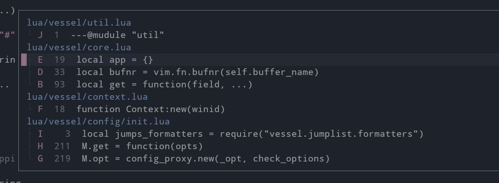

## vessel.nvim

Interactive `marks` and `jumps` lists popup window.



## Setup

In order to create commands and potentially override any default option you can call the usual `setup` function by passing one single optional `table` as argument.

**Commands are not automatically created**. In order to create them, you need to set the `create_commands` option. As you can see, you can even decide the commands names.

```lua
require("vessel").setup({ create_commands = true })
```

Calling the `setup` function is not required for using the plugin as internal `<plug>` mappings are automatically created for you.

### Mark list mappings

- `<plug>(VesselViewMarks)` Show all global (uppercase) and local marks (lowercase)
- `<plug>(VesselViewLocalMarks)` Show only local marks (lowercase)
- `<plug>(VesselViewGlobalMarks)` Show only global marks (uppercase)
- `<plug>(VesselViewExternalMarks)` Show only global marks belonging to different files
- `<plug>(VesselSetLocalMark)` Set/unset a *local* mark on the current line by automatically choosing the mark for you
- `<plug>(VesselSetGlobalMark)` Set/unset a *global* mark on the current line by automatically choosing the mark for you

### Jump list mappings

- `<plug>(VesselViewJumps)` Show the whole jump list
- `<plug>(VesselViewLocalJumps)` Show only jumps inside the current file
- `<plug>(VesselViewExternalJumps)` Show only jumps outside the current file

### Example mappings

Here how to use `<plug>` mappings in lua

```lua
vim.keymap.set("n", "gl", "<Plug>(VesselViewLocalJumps)")
vim.keymap.set("n", "gL", "<Plug>(VesselViewJumps)")
```

and vimscript

```vim
nnoremap m. <plug>(VesselSetLocalMark)
nnoremap m, <plug>(VesselSetGlobalMark)
```

### Mark list window

The `:Marks`  command opens a popup window with all global and local marks grouped by the file they belong to. Once inside the window the following mappings are available:

- `q`, `<ESC>` Close the popup window
- `<C-J>` Move to the next path
- `<C-K>` Move to the previous path
- `d` Delete the mark on the current line
- `l`, `<CR>` Jump to the mark (or path) under cursor
- `o` Jump to the mark under cursor (does not change the jump list)
- `v` Open the mark under cursor in a vertical split
- `V` Open the mark under cursor in a vertical split with (does not change the jump list)
- `s` Open the mark under cursor in a horizontal
- `S` Open the mark under cursor in a horizontal split (does not change the jump list)
- `t` Open the mark under cursor in a new tab
- `T` Open the mark under cursor in a new tab (does not change the jump list)
- `m{a-zA-Z}` Change the mark under cursor
- `'{a-z-A-Z}` Jump directly to a mark

### Jump list window

The `:Jumps` command opens a popup window showing the entire jump list. Jumps are displayed top to bottom, with most recent jump being on top. The cursor is automatically placed on the current position in the jump list. Once inside the window the following mappings are available:

- `l`, `<CR>` Jump to the line under cursor
- `q`, `<ESC>` Close the popup window
- `C` Clear the entire jump list
- `<C-O>` Move backwards in the jump list (towards the bottom). As a `count`, you can use the relative number displayed on the left column
- `<C-I>` Move forward in the jump list (towards the top). As a `count`, you can use the relative number displayed on the left column

## API

All API functions take a single optional `opts` table argument if you want to override the default options or and every option you provided to the `setup` function.

### Mark list API

- `vessel.view_marks(opts, filter_func)` Show all global (uppercase) and local marks (lowercase)
- `vessel.view_local_marks(opts)` Show only local marks (lowercase)
- `vessel.view_global_marks(opts)` Show only global marks (uppercase)
- `vessel.view_external_marks(opts)` Show only global marks belonging to different files
- `vessel.set_local_mark(opts)` Set/unset a *local* mark on the current line by automatically choosing the mark for you
- `vessel.set_global_mark(opts)` Set/unset a *global* mark on the current line by automatically choosing the mark for you

`filter_func` is a function used to filter out entries in the mark list. If the function returns `false`, the mark is removed from the list. The function takes two arguments:

- [`mark`](#mark-object) *table* parameter representing the mark currently being filtered
- [`context`](#context-object) *table* parameter that contains information about the current window/buffer.

```lua
-- Example usage `of a filter function to show only lowercase marks
vim.keymap.set("n", "gm", function()
  require('vessel').view_marks({}, function(mark, context)
    return string.match(mark.mark, "%l")
  end)
end)
```
### Jump list API

- `vessel.view_jumps(opts, filter_func)` Show the whole jump list
- `vessel.view_local_jumps(opts)` Show only jumps inside the current file
- `vessel.view_external_jumps(opts)` Show only jumps outside the current file

`filter_func` is a function used to filter out entries in the jump list. If the function returns `false`, the entry is removed from the list. The function takes two arguments:

- [`jump`](#jump-object) *table* parameter representing the jump entry currently being filtered
- [`context`](#context-object) *table* parameter that contains information about the current window/buffer.

```lua
-- Usage of a filter function to filter out jumps outside the current working directory
vim.keymap.set("n", "gL", function()
  require('vessel').view_jumps({}, function(jump, context)
    return vim.startswith(jump.bufpath, vim.fn.getcwd() .. "/")
  end)
end)
```

### Context object

Throughout the *API* documentation we will refer to the `context`  as something that contains information about the current window/buffer, that is the buffer currently being edited. It is a `table` object with the following keys:

- `bufnr` Current buffer number
- `bufpath` Current buffer full path
- `wininfo` Window information as returned by `vim.fn.getwininfo()`
- `curpos` Cursor position as returned by `vim.fn.getcurpos()`

### Mark object

The `Mark` object is `table` with the following keys:

- `mark` Mark letter
- `lnum` Mark line number
- `col` Mark column number
- `line` Line content on which the mark is positioned
- `file` File the mark belongs to
- `loaded` Whether the file is actually loaded in memory

### Jump object

The `Jump` object is `table` with the following keys:

- `current` Whether this jump occupy the current position in the jump list
- `pos` Position of the jump in the jump list
- `rel` Position of the jump relative to the current position in the jump list
- `bufnr` Buffer number
- `bufpath` Buffer full path
- `lnum` Jump line number
- `col` Jump column number
- `line` Line content on which the jump is positioned

### Modes

Modes represent how you are jumping to the targeted location. They are defined as follows:

```lua
local util = require("vessel.util")
util.modes = {
  BUFFER = 1,
  SPLIT = 2,
  VSPLIT = 3,
  TAB = 4,
}

```

## Configuration

You can configure the plugin in different ways. The most obvious one is by calling the classic `setup` function. Calling this function is *required* if you want to create all predefined commands.

```lua
require("vessel").setup({
  create_commands = true,
  commands = {
    view_marks = "Marks", -- you can customize each command name
    view_jumps = "Jumps"
  },
  window = {
    relativenumber = true
  }
})
```

The plugin also offers a more succinct way of setting options by providing a `opt` interface object

```lua
local vessel = require("vessel")
vessel.opt.highlight_on_jump = true
vessel.opt.window.max_height = 50
vessel.opt.marks.mappings.close = { "Q" }
```

The third way of setting options is by directly passing and option `table`  argument to *API* functions. This options will override anything you set previously via the `setup` function or `opt` interface object.

```lua
vim.keymap.set("n", "g", function()
  require('vessel').view_jumps({ window = { max_height = 90 } })
end)
```

### Generic options

```lua
local vessel = require("vessel")

-- Control how much noisy the plugin is (one of :help vim.log.levels)
vessel.opt.verbosity = vim.log.levels.INFO

-- Some global marks might belong to files currently not loaded in memory.
-- In this case the plugin can't retrieve the mark line content. Set this option
-- to `false` to load in memory any such file as soon as you open the mark list window.
vessel.opt.lazy_load_buffers = true

-- Set 'cursorline' nvim option for a brief period of time after a jump
-- for 'highlight_timeout' milliseconds
vessel.opt.highlight_on_jump = false
vessel.opt.highlight_timeout = 250

-- Function executed after each jump. By default it just centers the cursor vertically
-- unless vim.o.jumpotions is set to 'view'. It takes two parameters: mode and context,
-- both described in the API section of the documentation.
vessel.opt.jump_callback = <function>
```

### Window options

```lua
local vessel = require("vessel")

-- Control the maximum height of the popup window as a percentage of the nvim UI
vessel.opt.window.max_height = 80

-- Enable/disable 'cursorline' nvim option in the popup window
vessel.opt.window.cursorline = true

-- Enable/disable 'number' nvim option in the popup window
vessel.opt.window.number = false

-- Enable/disable 'relativenumber' nvim option in the popup window
vessel.opt.window.relativenumber = false
```

```lua
local vessel = require("vessel")

--- Control how the popup looks. This options are passed directly to the
-- vim.api.nvim_open_win() function. ( See:help api-floatwin).

-- 'heigh', 'width', 'row' and 'col' may be either a number or function.
-- In the latter case the function is evaluated and its return value (must be a number)
-- used as the option value. See section below for their default implementations.

vessel.opt.window.options.relative = "editor"
vessel.opt.window.options.anchor = "NW"
vessel.opt.window.options.style = "minimal"
vessel.opt.window.options.border = "single"
vessel.opt.window.options.width = popup_width
vessel.opt.window.options.height = popup_height
vessel.opt.window.options.row = popup_row
vessel.opt.window.options.col = popup_col
```

### Default popup size and positioning functions

```lua
---@param list Marklist|Jumplist
local function popup_height(list)
	local max_height = list.app.config.window.max_height
	 -- list:get_count() returns the number of entries + the number of groups
    -- (always 1 for the jump list)
	local item_count, group_count = list:get_count()
	local max_lines = item_count + group_count
	local max = math.floor(vim.o.lines * max_height / 100)
	return math.min(max_lines, max)
end

local function popup_width()
	local ui = vim.api.nvim_list_uis()[1]
	return math.floor(ui.width * (ui.width < 120 and 90 or 70) / 100)
end

---@param width integer The 'width' previously computed
---@param height integer The 'height' previously computed
local function popup_row(width, height)
	return math.floor((vim.o.lines / 2) - ((height + 2) / 2)) - 1
end

---@param width integer The 'width' previously computed
---@param height integer The 'height' previously computed
local function popup_col(width, height)
	local ui = vim.api.nvim_list_uis()[1]
	return math.floor((ui.width / 2) - (width / 2))
end

```
### Commands options

```lua
local vessel = require("vessel")

-- Whether to create commands or not
-- Note: you need to call the setup function to actually create commands
vessel.opt.create_commands = false

-- Customize each command name
vessel.opt.commands.view_marks = "Marks"
vessel.opt.commands.view_jumps = "Jumps"
```

### Mark list options

```lua
local vessel = require("vessel")

-- The pool of marks the plugin chooses from when automatically picking the letter for you
vessel.opt.marks.locals = "abcdefghijklmnopqrstuvwxyz"
vessel.opt.marks.globals = "ABCDEFGHIJKLMNOPQRSTUVWXYZ"

-- Function used to sort groups. A group is a set of marks belonging to the same file.
-- Default: function(a, b) return a > b end
vessel.opt.marks.sort_groups = <function>

-- Function used to sort marks in the each groups. By default marks are sorted by line number.
-- Default: function(a, b) return a.lnum < b.lnum end
-- Use this to sort marks alphabetically: function(a, b) return a.mark > b.mark end
vessel.opt.marks.sort_marks = <function>

-- Enable/disable unsetting a mark when trying to mark an alredy marked line
vessel.opt.marks.toggle_mark = true

-- Use backtick instead of apostrophe for jumping to marks (:help mark-motions)
vessel.opt.marks.use_backtick = false

-- Message used when the mark list is empty
vessel.opt.marks.not_found = "No marks found"

-- Position the cursor on the first line of a mark group
vessel.opt.marks.move_to_first_mark = true

-- Position the cursor on the closest mark relative to the current position in the buffer.
-- If a mark is farther from the cursor than 'proximity_threshold' lines, it won't be considered
vessel.opt.marks.move_to_closest_mark = true
vessel.opt.marks.proximity_threshold = 50

-- Force displaying the group header (file path) even when there is just one group
-- Note: Has effect only when using default formatters
vessel.opt.marks.force_header = false

-- Decorations used as prefix to each formatted mark.
-- Last item is for last entries in each group.
-- Note: Has effect only when using default formatters
vessel.opt.marks.decorations = { "├ ", "└ " }

-- Show/hide mark column number
-- Note: Has effect only when using default formatters
vessel.opt.marks.show_colnr = false

-- Strip leading spaces from lines
-- Note: Has effect only when using default formatters
vessel.opt.marks.strip_lines = true

-- Functions used to format each mark / group header line
-- See "Formatters" section for more info
vessel.opt.marks.formatters.mark = <function>
vessel.opt.marks.formatters.header = <function>

-- Highlight groups used by default formatters
vessel.opt.marks.highlights.path = "Directory"
vessel.opt.marks.highlights.not_loaded = "Comment"
vessel.opt.marks.highlights.decorations = "NonText"
vessel.opt.marks.highlights.mark = "Keyword"
vessel.opt.marks.highlights.lnum = "LineNr"
vessel.opt.marks.highlights.col = "LineNr"
vessel.opt.marks.highlights.line = "Normal"

-- Close the popup window
vessel.opt.marks.mappings.close = { "q", "<esc>" }

-- Delete the mark under cursor
vessel.opt.marks.mappings.delete = { "d" }

-- Move to the next group header
vessel.opt.marks.mappings.next_group = { "<c-j>" }

-- Move to the previous group header
vessel.opt.marks.mappings.prev_group = { "<c-k>" }

-- Jump to the mark (or path) under cursor
vessel.opt.marks.mappings.jump = { "l", "<cr>" }

-- Jump to the mark under cursor (does not change the jump list)
vessel.opt.marks.mappings.keepj_jump = { "o" }

-- Open the mark under cursor in a new tab
vessel.opt.marks.mappings.tab = { "t" }

-- Open the mark under cursor in a new tab (does not change the jump list)
vessel.opt.marks.mappings.keepj_tab = { "T" }

-- Open the mark under cursor in a horizontal
vessel.opt.marks.mappings.split = { "s" }

-- Open the mark under cursor in a horizontal split (does not change the jump list)
vessel.opt.marks.mappings.keepj_split = { "S" }

-- Open the mark under cursor in a vertical split
vessel.opt.marks.mappings.vsplit = { "v" }

-- Open the mark under cursor in a vertical split with (does not change the jump list)
vessel.opt.marks.mappings.keepj_vsplit = { "V" }
```

### Jump list options

```lua
local vessel = require("vessel")

-- Display real jump entries positions.
-- There might be gaps when filters are applied to the list.
vessel.opt.jumps.real_positions = false

-- Strip leading spaces from lines
vessel.opt.jumps.strip_lines = false

-- Filter jump entries that point to empty lines
vessel.opt.jumps.filter_empty_lines = true

-- Message used when the jump list is empty
vessel.opt.jumps.not_found = "Jump list empty"

-- Prefix used for each formatted jump entry.
-- First item is the line of the current position in the jump list.
-- Note: Has effect only when using default formatters
vessel.opt.jumps.indicator = { " ", " " }

-- Show/hide jump entries column numbers
-- Note: Has effect only when using default formatters
vessel.opt.jumps.show_colnr = false

-- Functions used to format each jump entry line
-- See "Formatters" section for more info
vessel.opt.jumps.formatters.jump = <function>

-- Mapping used to move backwards in the jump list (to the bottom of the window). Takes a count.
vessel.opt.jumps.mappings.ctrl_o = "<c-o>"

-- Mapping used to move forwards in the jump list (to the top of the window). Takes a count.
vessel.opt.jumps.mappings.ctrl_i = "<c-i>"

-- Jump to the entry under cursor
vessel.opt.jumps.mappings.jump = { "l", "<cr>" }

-- Close the popup window
vessel.opt.jumps.mappings.close = { "q", "<esc>" }

-- Clear the jump list (executes :clearjumps)
vessel.opt.jumps.mappings.clear = { "C" }

-- Highlight groups used by default formatters
vessel.opt.jumps.highlights.indicator = "Comment"
vessel.opt.jumps.highlights.pos = "LineNr"
vessel.opt.jumps.highlights.current_pos = "CursorLineNr"
vessel.opt.jumps.highlights.path = "Directory"
vessel.opt.jumps.highlights.lnum = "LineNr"
vessel.opt.jumps.highlights.col = "LineNr"
vessel.opt.jumps.highlights.line = "Normal"
```
